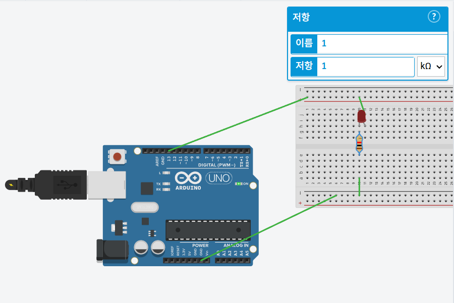

# 아두이노 GPIO LED 제어

## 1. 수행 목표

아두이노의 GPIO 핀으로 LED를 제어하고, 모스 부호 S.O.S 패턴을 LED 점멸로 출력한다.
또한 여러 LED 또는 NeoPixel을 사용할 때 필요한 전류와 외부 전원 조건을 정리한다.

---

## 2. 개발환경

| 구분 | 내용 |
| --- | --- |
| 개발 보드 | Arduino UNO |
| 개발 도구 | Arduino IDE 또는 Tinkercad Circuits |
| 개발 언어 | Arduino C/C++ |
| 출력 장치 | 기본 LED, 외부 LED, NeoPixel LED |
| 부품 | 220Ω 저항, 점퍼선, 브레드보드 |
| 전원 | USB 전원 또는 외부 5V DC 어댑터 |

---

## 3. GPIO 기본 개념

GPIO는 `General Purpose Input/Output`의 약자로, 마이크로컨트롤러가 외부 장치와 디지털 신호를 주고받는 핀이다.

```text
입력 모드: 버튼, 센서 신호 읽기
출력 모드: LED, 부저, 릴레이 제어
```

Arduino UNO의 디지털 출력은 다음과 같이 동작한다.

```text
HIGH → 약 5V
LOW  → 약 0V
```

---

## 4. 주요 GPIO 명령어

| 명령어 | 역할 | 예시 |
| --- | --- | --- |
| `pinMode()` | 핀의 입력/출력 설정 | `pinMode(8, OUTPUT);` |
| `digitalWrite()` | 디지털 출력 HIGH/LOW 설정 | `digitalWrite(8, HIGH);` |
| `digitalRead()` | 디지털 입력값 읽기 | `digitalRead(7);` |
| `analogWrite()` | PWM 출력으로 밝기 제어 | `analogWrite(9, 128);` |

`analogWrite()`는 실제 아날로그 전압을 출력하는 것이 아니라 HIGH와 LOW를 빠르게 반복하는 PWM 방식이다.

---

## 5. 기본 LED 회로

외부 LED는 반드시 전류 제한 저항과 함께 연결한다.

```text
Arduino D8
→ 220Ω 저항
→ LED 애노드(+)
→ LED 캐소드(-)
→ GND
```

| LED 단자 | 연결 |
| --- | --- |
| 긴 다리, 애노드 | 저항을 통해 GPIO 핀 연결 |
| 짧은 다리, 캐소드 | GND 연결 |

내장 LED를 사용할 때는 `LED_BUILTIN`을 사용하면 된다.

---

## 6. S.O.S 모스 부호 설계

모스 부호에서 S는 짧은 신호 3개, O는 긴 신호 3개이다.

```text
S = · · ·
O = ― ― ―
S = · · ·
```

기본 시간 단위는 `200ms`로 설정한다.

| 구분 | 시간 |
| --- | --- |
| 점 | 1단위 = 200ms |
| 선 | 3단위 = 600ms |
| 문자 사이 간격 | 3단위 |
| 반복 사이 간격 | 7단위 |

---

## 7. 주요 소스 코드 및 회로 이미지

### 7.1 회로 이미지



회로는 Arduino UNO의 디지털 핀에서 LED를 제어하고, LED에는 전류 제한 저항을 직렬로 연결하는 구조이다.

### 7.2 주요 소스 코드

```cpp
const int LED_PIN = 13;
const int UNIT = 200;  // 모스 부호 기본 시간: 0.2초

// 점 또는 선 출력
void signal(int duration) {
  digitalWrite(LED_PIN, HIGH);
  delay(duration);

  digitalWrite(LED_PIN, LOW);
  delay(UNIT);                  // 신호 사이 간격
}

// S = 점 3개
void outputS() {
  signal(UNIT);
  signal(UNIT);
  signal(UNIT);
}

// O = 선 3개
void outputO() {
  signal(UNIT * 3);
  signal(UNIT * 3);
  signal(UNIT * 3);
}

void setup() {
  pinMode(LED_PIN, OUTPUT);
  digitalWrite(LED_PIN, LOW);
}

void loop() {
  // S: · · ·
  outputS();

  // 문자 사이 전체 간격은 3단위
  // 마지막 signal()에서 1단위 쉬었으므로 2단위 추가
  delay(UNIT * 2);

  // O: ― ― ―
  outputO();
  delay(UNIT * 2);

  // S: · · ·
  outputS();

  // SOS 반복 사이 전체 간격은 7단위
  // 마지막 signal()에서 1단위 쉬었으므로 6단위 추가
  delay(UNIT * 6);
}
```

### 동작 결과

```text
짧게 3번
→ 길게 3번
→ 짧게 3번
→ 긴 대기
→ 반복
```

`loop()` 함수가 계속 반복되므로 S.O.S 신호는 전원을 끄기 전까지 반복 출력된다.

---

## 8. NeoPixel 사용 시

NeoPixel은 여러 RGB LED를 하나의 데이터 핀으로 제어할 수 있다.

```text
Arduino D6 → 330~470Ω 저항 → NeoPixel DIN
외부 5V 어댑터 + → NeoPixel 5V
외부 5V 어댑터 - → NeoPixel GND
Arduino GND → NeoPixel GND
```

아두이노와 외부 전원의 GND는 반드시 공통으로 연결해야 한다.

Arduino IDE에서는 다음 라이브러리를 설치한다.

```text
Sketch
→ Include Library
→ Manage Libraries
→ Adafruit NeoPixel 검색
→ Install
```

---

## 9. 전류와 전원 계산

일반 LED는 보통 10~20mA 정도로 설계한다.
5V에서 빨간 LED와 220Ω 저항을 사용할 때 전류는 대략 다음과 같다.

```text
전류 = (5V - 2V) / 220Ω
     ≒ 13.6mA
```

NeoPixel은 흰색 최대 밝기 기준으로 1개당 약 60mA로 계산한다.

```text
최대 전류 = NeoPixel 개수 × 0.06A
```

| NeoPixel 개수 | 최대 전류 | 권장 어댑터 |
| ---: | ---: | ---: |
| 8개 | 0.48A | 5V 1A 이상 |
| 16개 | 0.96A | 5V 2A 이상 |
| 30개 | 1.8A | 5V 3A 이상 |
| 60개 | 3.6A | 5V 5A 이상 |

여유 전류를 고려해 계산값보다 큰 어댑터를 선택하는 것이 안전하다.

---

## 10. 주의사항

| 항목 | 주의할 점 |
| --- | --- |
| GPIO 전류 제한 | 많은 LED를 GPIO에 직접 연결하지 않는다. |
| LED 저항 | LED에는 전류 제한 저항을 사용한다. |
| 외부 전원 | 많은 LED는 별도 5V 어댑터를 사용한다. |
| GND 공통 | Arduino GND와 외부 전원 GND를 연결한다. |
| NeoPixel 방향 | 데이터 입력은 DIN에 연결한다. |
| 전압 변동 | LED 전원 근처에 커패시터를 추가하면 안정적이다. |

---

## 11. Tinkercad 실습 순서

```text
1. Create New Circuit 선택
2. Arduino UNO 배치
3. LED와 220Ω 저항 배치
4. GPIO 핀과 LED 연결
5. Code 메뉴에서 Text 모드 선택
6. S.O.S 코드 입력
7. Start Simulation 실행
8. LED 점멸 확인
```

---

## 12. 최종 확인

| 확인 항목 | 기준 |
| --- | --- |
| GPIO 설정 | LED 핀을 출력 모드로 설정 |
| 회로 구성 | LED와 저항을 직렬 연결 |
| S.O.S 패턴 | 짧게 3번, 길게 3번, 짧게 3번 |
| 반복 동작 | `loop()`에서 계속 반복 |
| 전원 계산 | LED 개수에 맞는 전류 확인 |
| 외부 전원 | NeoPixel 사용 시 GND 공통 연결 |

---

## 13. 정리

아두이노 GPIO 핀은 `pinMode()`로 방향을 설정하고, `digitalWrite()`로 HIGH 또는 LOW를 출력하여 LED를 제어한다.
S.O.S 모스 부호는 점 3개, 선 3개, 점 3개로 구성되며, 시간 단위를 정하면 LED 점멸 패턴으로 표현할 수 있다.

일반 LED는 저항을 사용해 전류를 제한해야 하며, NeoPixel처럼 여러 LED를 사용할 때는 개수에 맞는 외부 5V 전원과 공통 GND 연결이 필요하다.
