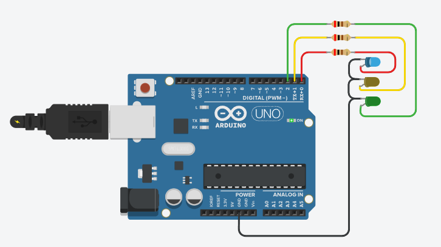

# 아두이노 개발환경

## 1. 수행 목표

Arduino IDE를 설치하고 아두이노 보드를 PC에 연결한 뒤, 첫 번째 스케치 프로그램을 작성, 컴파일, 업로드하는 과정을 정리한다.

핵심 목표는 다음과 같다.

1. Arduino IDE 설치
2. 보드와 포트 선택
3. 새 스케치 작성
4. Blink 예제 업로드
5. 라이브러리 추가
6. 시리얼 모니터 사용
7. 업로드 오류 해결

---

## 2. 개발환경

| 구분 | 내용 |
| --- | --- |
| 운영체제 | Windows 또는 Linux |
| 개발 도구 | Arduino IDE |
| 개발 언어 | Arduino C/C++ |
| 실습 보드 | Arduino UNO 기준 |
| 연결 방식 | USB 케이블 |
| 기본 예제 | LED Blink, Serial Monitor |

아두이노 개발 흐름은 다음과 같다.

```text
코드 작성
→ 컴파일
→ 보드 선택
→ 포트 선택
→ 업로드
→ 실행 확인
```

---

## 3. Arduino IDE 설치

Arduino IDE는 아두이노 보드용 프로그램을 작성하고 업로드하는 통합 개발 환경이다.

설치 절차는 다음과 같다.

```text
Arduino 공식 웹사이트 접속
→ Software / Arduino IDE 다운로드
→ 운영체제에 맞는 설치 파일 선택
→ 설치 파일 실행
→ USB 드라이버 설치 허용
→ Arduino IDE 실행
```

Windows에서는 설치 중 USB 드라이버 설치를 허용해야 보드가 정상 인식된다.
Linux에서 포트 권한 문제가 발생하면 사용자를 `dialout` 그룹에 추가할 수 있다.

```bash
sudo usermod -aG dialout $USER
```

명령 실행 후 로그아웃했다가 다시 로그인하면 적용된다.

---

## 4. 보드 연결 및 설정

### 4.1 USB 연결

아두이노 보드를 데이터 통신이 가능한 USB 케이블로 PC에 연결한다.
충전 전용 케이블은 전원 LED는 켜질 수 있지만 업로드가 되지 않을 수 있다.

```text
PC USB 포트
→ USB 케이블
→ Arduino 보드
```

### 4.2 보드 선택

Arduino UNO 기준 보드 선택 경로는 다음과 같다.

```text
Tools
→ Board
→ Arduino AVR Boards
→ Arduino Uno
```

보드마다 MCU, 클럭, 메모리, 핀 구성이 다르므로 실제 사용하는 보드를 정확히 선택해야 한다.

### 4.3 포트 선택

```text
Tools
→ Port
→ 연결된 Arduino 포트 선택
```

Windows에서는 `COM3`, `COM4`처럼 보이고, Linux에서는 `/dev/ttyACM0`, `/dev/ttyUSB0`처럼 보일 수 있다.

---

## 5. 새 스케치 작성

새 프로젝트는 다음 메뉴에서 만든다.

```text
File
→ New Sketch
```

기본 구조는 다음과 같다.

```cpp
void setup() {
  // 처음 한 번 실행
}

void loop() {
  // 계속 반복 실행
}
```

`setup()`은 핀 모드, 시리얼 통신, 초기값 설정에 사용한다.
`loop()`는 센서 읽기, LED 제어, 모터 제어처럼 반복 동작을 작성하는 부분이다.

---

## 6. 첫 번째 예제: LED Blink

Arduino UNO에는 13번 핀에 내장 LED가 연결되어 있어 별도 부품 없이 Blink 예제를 실행할 수 있다.

```cpp
const int ledPin = 13;

void setup() {
  pinMode(ledPin, OUTPUT);
}

void loop() {
  digitalWrite(ledPin, HIGH);
  delay(1000);

  digitalWrite(ledPin, LOW);
  delay(1000);
}
```

| 코드 | 의미 |
| --- | --- |
| `pinMode(ledPin, OUTPUT)` | 13번 핀을 출력으로 설정 |
| `digitalWrite(HIGH)` | LED 켜기 |
| `digitalWrite(LOW)` | LED 끄기 |
| `delay(1000)` | 1초 대기 |

실행 결과는 LED가 1초 켜지고 1초 꺼지는 동작을 반복하는 것이다.

---

## 7. 컴파일과 업로드

검증은 코드를 보드에 올리지 않고 문법과 컴파일 가능 여부만 확인하는 과정이다.

```text
Verify
→ 문법 검사
→ 컴파일
→ 오류 확인
```

업로드는 컴파일된 바이너리를 보드에 전송하는 과정이다.

```text
Upload
→ 컴파일
→ 보드/포트 확인
→ 바이너리 전송
→ 보드에서 실행
```

업로드가 완료되면 IDE 하단에 완료 메시지가 표시되고, 보드에서 프로그램이 자동 실행된다.

---

## 8. 직접 작성한 예제

아래 코드는 LED가 빠르게 두 번 깜박이고 잠시 쉬는 프로그램이다.

```cpp
const int ledPin = 13;

void setup() {
  pinMode(ledPin, OUTPUT);
}

void loop() {
  digitalWrite(ledPin, HIGH);
  delay(200);
  digitalWrite(ledPin, LOW);
  delay(200);

  digitalWrite(ledPin, HIGH);
  delay(200);
  digitalWrite(ledPin, LOW);
  delay(1000);
}
```

동작 흐름은 다음과 같다.

```text
0.2초 켜짐
→ 0.2초 꺼짐
→ 0.2초 켜짐
→ 1초 꺼짐
→ 반복
```

---

## 9. 라이브러리 추가

라이브러리는 센서, 모터, LCD, 통신 모듈 등을 쉽게 사용하기 위한 코드 모음이다.

```text
Sketch
→ Include Library
→ Manage Libraries
```

| 라이브러리 | 용도 |
| --- | --- |
| Servo | 서보 모터 제어 |
| LiquidCrystal | LCD 문자 출력 |
| DHT sensor library | 온습도 센서 사용 |
| Wire | I2C 통신 |
| SPI | SPI 통신 |

설치한 라이브러리는 코드 상단에서 불러온다.

```cpp
#include <Servo.h>
```

---

## 10. 시리얼 모니터

시리얼 모니터는 보드에서 PC로 출력되는 데이터를 확인하는 도구이다.
센서값 확인과 디버깅에 자주 사용된다.

```text
Tools
→ Serial Monitor
```

예제 코드는 다음과 같다.

```cpp
void setup() {
  Serial.begin(9600);
}

void loop() {
  Serial.println("Hello Arduino");
  delay(1000);
}
```

시리얼 모니터의 Baud Rate는 코드의 `Serial.begin(9600)`과 같게 맞춰야 한다.

---

## 11. 센서값 확인 예제

조도 센서나 가변저항을 A0 핀에 연결하면 아날로그 값을 확인할 수 있다.

```cpp
const int sensorPin = A0;

void setup() {
  Serial.begin(9600);
}

void loop() {
  int sensorValue = analogRead(sensorPin);

  Serial.print("Sensor Value: ");
  Serial.println(sensorValue);

  delay(500);
}
```

아두이노 UNO의 아날로그 입력값은 일반적으로 `0~1023` 범위로 표시된다.

---

## 12. 저장 및 관리

아두이노 코드는 일반적으로 `.ino` 파일로 저장된다.
스케치를 저장하면 같은 이름의 폴더 안에 `.ino` 파일이 생성된다.

```text
Blink_Test/
└── Blink_Test.ino
```

프로젝트 이름은 기능별로 구분하면 관리하기 쉽다.

```text
01_LED_Blink
02_Serial_Print
03_Sensor_Read
04_LED_Control
```

---

## 13. 기본 설정

환경 설정 메뉴는 다음 위치에 있다.

```text
File
→ Preferences
```

주요 설정은 다음과 같다.

| 설정 | 용도 |
| --- | --- |
| Sketchbook location | 스케치 저장 위치 |
| Editor font size | 편집기 글자 크기 |
| Show verbose output | 컴파일/업로드 상세 로그 |
| Additional Boards Manager URLs | 추가 보드 패키지 등록 |

업로드 오류 분석이 필요하면 상세 로그 출력을 켜는 것이 좋다.

---

## 14. 오류와 해결 방법

| 문제 | 원인 | 해결 |
| --- | --- | --- |
| 컴파일 실패 | 문법 오류, 라이브러리 누락 | 오류 줄 번호 확인 후 수정 |
| 업로드 실패 | 보드/포트 선택 오류 | Board와 Port 재확인 |
| 보드 미인식 | USB 케이블, 드라이버 문제 | 데이터 케이블 사용, 드라이버 설치 |
| Linux 포트 권한 오류 | 사용자 권한 부족 | `dialout` 그룹 추가 |
| LED 미동작 | 핀 번호 또는 배선 오류 | 코드와 회로 확인 |
| 시리얼 출력 없음 | `Serial.begin()` 누락 | 코드 확인 |
| 글자 깨짐 | Baud Rate 불일치 | 코드와 모니터 속도 일치 |

---

## 15. 확인 항목

| 확인 항목 | 완료 기준 |
| --- | --- |
| IDE 설치 | Arduino IDE 실행 가능 |
| 보드 연결 | 전원 LED 켜짐 |
| 보드 선택 | 실제 보드와 IDE 설정 일치 |
| 포트 선택 | 연결된 COM/tty 포트 선택 |
| Blink 컴파일 | Verify 성공 |
| Blink 업로드 | Upload 완료 |
| 동작 확인 | 내장 LED 점멸 |
| 시리얼 확인 | 출력값 정상 표시 |

---

## 16. 정리

Arduino IDE를 이용한 개발은 코드 작성, 컴파일, 보드 선택, 포트 선택, 업로드, 실행 확인 순서로 진행된다.
Blink 예제는 개발환경이 정상적으로 구축되었는지 확인하는 가장 기본적인 실습이다.

아두이노 개발에서 중요한 점은 실제 보드에 맞는 설정을 선택하고, 업로드 후 하드웨어가 예상대로 동작하는지 확인하는 것이다.
시리얼 모니터와 오류 메시지를 활용하면 센서값 확인과 문제 해결을 효율적으로 할 수 있다.

---

## 17. 추가 실습: 3색 LED 신호등 제어

아두이노에 빨강, 노랑, 초록 LED를 연결하여 신호등처럼 순서대로 켜지는 프로그램을 만들 수 있다.
각 LED는 디지털 출력 핀에 연결하고, LED와 핀 사이에는 전류 제한용 저항을 연결한다.

### 17.1 회로 구성



| LED 색상 | 아두이노 핀 | 동작 |
| --- | --- | --- |
| 빨강 LED | D0 | 3초 동안 켜짐 |
| 노랑 LED | D1 | 1초 동안 켜짐 |
| 초록 LED | D2 | 2초 동안 켜짐 |

```text
D0 → 저항 → 빨강 LED → GND
D1 → 저항 → 노랑 LED → GND
D2 → 저항 → 초록 LED → GND
```

D0, D1 핀은 시리얼 통신에도 사용될 수 있으므로, 실제 실습에서 업로드나 시리얼 모니터 문제가 생기면 D3, D4, D5 같은 다른 디지털 핀으로 바꾸는 것이 좋다.

### 17.2 예제 코드

아래 코드는 별도 스케치 파일로도 저장되어 있다.

[traffic_light.ino](traffic_light/traffic_light.ino)

```cpp
int led_red = 0;
int led_yellow = 1;
int led_green = 2;

void setup() {
  pinMode(led_red, OUTPUT);
  pinMode(led_yellow, OUTPUT);
  pinMode(led_green, OUTPUT);
}

void loop() {
  // 초록 LED 켜기
  digitalWrite(led_red, LOW);
  digitalWrite(led_yellow, LOW);
  digitalWrite(led_green, HIGH);
  delay(2000);

  // 노랑 LED 켜기
  digitalWrite(led_red, LOW);
  digitalWrite(led_yellow, HIGH);
  digitalWrite(led_green, LOW);
  delay(1000);

  // 빨강 LED 켜기
  digitalWrite(led_red, HIGH);
  digitalWrite(led_yellow, LOW);
  digitalWrite(led_green, LOW);
  delay(3000);
}
```

### 17.3 동작 결과

```text
초록 LED 2초 점등
→ 노랑 LED 1초 점등
→ 빨강 LED 3초 점등
→ 반복
```

이 실습을 통해 여러 개의 디지털 출력 핀을 설정하고, 조건 없이 순서대로 LED를 제어하는 기본 방법을 확인할 수 있다.
