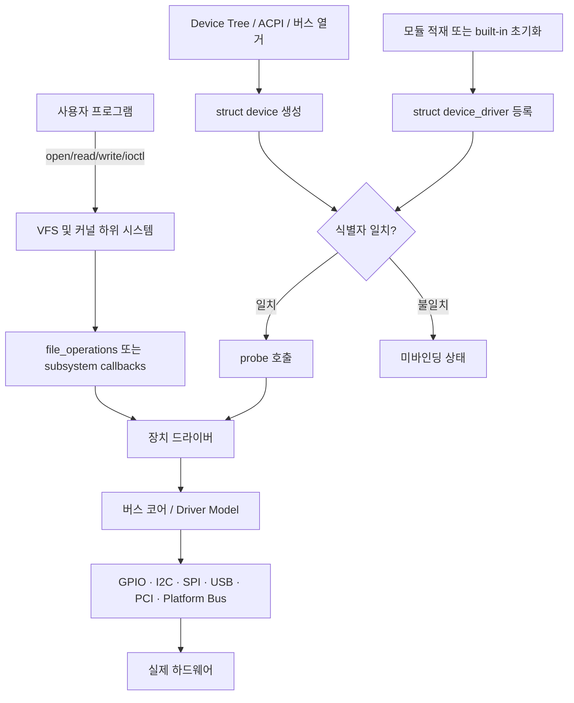
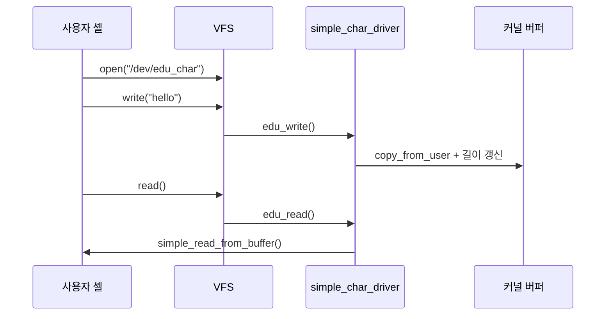

# 리눅스 드라이버와 커널 모듈

## 1. 수행 개요

| 항목 | 내용 |
|---|---|
| 학습 목표 | 리눅스 드라이버와 커널 모듈의 개념, 작성, 빌드, 적재, 제거 및 배포 방법 이해 |
| 개발 호스트 | Ubuntu/Debian 계열 Linux 또는 동등한 커널 개발 환경 |
| 대상 장치 | Raspberry Pi 4(ARM64) 또는 테스트용 Linux 가상 머신 |
| 실습 결과물 | `hello_module.ko`, `simple_char_driver.ko` |
| 문서 상태 | 절차 및 소스 작성 완료, 실제 커널 빌드·보드 적재는 대상 Linux 환경에서 수행 필요 |

이 보고서는 단순히 커널에 메시지를 출력하는 **커널 모듈**과 `/dev/edu_char` 장치를 등록하는 **문자 장치 드라이버**를 각각 구현한다. 두 예제를 분리함으로써 “모듈”은 코드의 배치·적재 방식이고 “드라이버”는 장치를 제어하는 소프트웨어의 역할이라는 차이를 확인한다.

> 안전 주의: 커널 모듈은 커널 권한으로 실행된다. 잘못된 포인터, 동시성 오류, 자원 해제 누락은 Oops, 교착, 파일시스템 손상 또는 커널 패닉을 일으킬 수 있다. 먼저 가상 머신이나 복구 가능한 Raspberry Pi에서 시험하고, 중요 데이터가 있는 운영 장비에서 처음 적재하지 않는다.

---

## 2. 핵심 개념

### 2.1 커널 모듈이란

커널 모듈(Loadable Kernel Module, LKM)은 실행 중인 커널에 필요할 때 동적으로 연결하거나 제거할 수 있는 커널 코드이다. 일반적으로 `.ko` 파일로 생성되며 다음 요소를 가진다.

- `module_init()`으로 등록한 초기화 함수
- `module_exit()`으로 등록한 종료 함수
- `MODULE_LICENSE`, `MODULE_DESCRIPTION`, `MODULE_AUTHOR` 등의 메타데이터
- 필요하면 `module_param()`으로 노출하는 적재 매개변수
- 커널이 내보낸 심볼을 사용하는 코드와 재배치 정보

모듈을 사용하면 전체 커널을 다시 부팅하지 않고 기능을 추가할 수 있고, 기본 커널 이미지 크기를 줄일 수 있다. 반면 커널과 같은 주소 공간에서 실행되므로 사용자 프로그램처럼 프로세스 격리로 보호되지 않는다.

### 2.2 장치 드라이버란

장치 드라이버는 하드웨어 또는 논리 장치를 커널의 표준 하위 시스템에 연결하는 코드이다. 응용 프로그램이 하드웨어 레지스터와 인터럽트를 직접 다루지 않고 파일, 네트워크 인터페이스, 입력 장치 등의 공통 인터페이스로 접근하게 한다.

주요 역할은 다음과 같다.

- 장치 탐색과 드라이버 바인딩
- MMIO, I/O 포트, GPIO, IRQ, DMA, 클록, 레귤레이터 등의 자원 획득
- 장치 초기화와 전원 관리
- 읽기·쓰기·제어 요청 처리
- 오류 복구와 동시 접근 직렬화
- 제거 시 등록한 인터페이스와 모든 자원 정리

### 2.3 드라이버와 모듈의 차이

| 구분 | 커널 모듈 | 장치 드라이버 |
|---|---|---|
| 중심 의미 | 커널 코드를 적재·제거하는 방식 | 장치를 제어하고 커널 하위 시스템에 연결하는 역할 |
| 반드시 하드웨어를 다루는가 | 아니다 | 일반적으로 장치나 논리 장치를 다룬다 |
| 반드시 `.ko`인가 | 적재형 모듈이면 그렇다 | 아니다. 커널에 built-in(`=y`)될 수도 있다 |
| 주요 진입점 | `module_init`, `module_exit` | 버스의 `probe`, `remove` 또는 장치 등록/해제 함수 |
| 예 | 추적 기능, 파일시스템, 보안 확장 | GPIO, I2C, SPI, USB, 네트워크, 문자 장치 드라이버 |

따라서 **모든 드라이버가 모듈인 것은 아니며, 모든 모듈이 드라이버인 것도 아니다.** 같은 드라이버 소스도 Kconfig에서 `y`이면 커널 내장, `m`이면 모듈로 빌드할 수 있다.

---

## 3. 전체 동작 구조



플랫폼 드라이버 기준의 순서는 다음과 같다.

1. 부트로더가 Device Tree를 커널에 전달한다.
2. 커널이 노드를 해석해 `platform_device`를 만든다.
3. 드라이버가 `platform_driver_register()`로 자신의 이름과 `of_match_table`을 등록한다.
4. Driver Core가 장치의 `compatible` 값과 드라이버 테이블을 비교한다.
5. 일치하면 드라이버의 `probe()`를 호출한다.
6. `probe()`는 자원을 획득하고 하드웨어를 초기화한 뒤 사용자 인터페이스를 등록한다.
7. 드라이버 해제나 장치 제거 시 `remove()`가 호출되고 관리 자원이 정리된다.

공식 Driver Model 문서에 따르면 장치와 드라이버가 일치하면 코어가 `probe()`를 호출하며, 드라이버 제거 시 바인딩된 장치에 대해 `remove()` 절차를 수행한다.

---

## 4. 주요 장치 등록 방식

드라이버 종류에 따라 등록 함수가 달라진다.

| 대상 | 대표 등록 함수 | 핵심 콜백/객체 |
|---|---|---|
| 플랫폼 장치 | `platform_driver_register()` / `module_platform_driver()` | `probe`, `remove`, `of_match_table` |
| I2C | `i2c_add_driver()` / `module_i2c_driver()` | `probe`, `remove`, `i2c_device_id` |
| SPI | `spi_register_driver()` / `module_spi_driver()` | `probe`, `remove`, `spi_device_id` |
| USB | `usb_register()` / `module_usb_driver()` | `probe`, `disconnect`, `usb_device_id` |
| PCI | `pci_register_driver()` / `module_pci_driver()` | `probe`, `remove`, `pci_device_id` |
| 문자 장치 | `alloc_chrdev_region()` + `cdev_add()` | `struct file_operations` |
| 단순 문자 장치 | `misc_register()` | `struct miscdevice`, `file_operations` |
| 네트워크 장치 | `register_netdev()` | `net_device_ops` |

`module_*_driver()` 계열 매크로는 단순한 등록/해제형 모듈의 `module_init()`과 `module_exit()` 반복 코드를 줄인다. 실제 하드웨어 드라이버에서는 버스별 API와 해당 하위 시스템 규칙을 우선 사용한다.

### 4.1 자원 관리 원칙

- 가능하면 `devm_kzalloc()`, `devm_platform_ioremap_resource()`, `devm_request_irq()` 같은 device-managed API를 사용한다.
- `probe()` 중간에 실패하면 얻은 자원을 역순으로 해제한다.
- IRQ와 프로세스 문맥에서 공유하는 상태는 적합한 락과 메모리 규칙으로 보호한다.
- 사용자 포인터는 직접 역참조하지 않고 `copy_to_user()`, `copy_from_user()` 등을 사용한다.
- 입력 길이와 레지스터 범위를 검증한다.
- 커널에서 부동소수점, 임의의 장시간 블로킹, 큰 스택 사용을 피한다.

---

## 5. 실습 구성

```text
kernel_module_examples/
├─ Makefile
├─ README.md
├─ hello_module.c
└─ simple_char_driver.c
```

### 5.1 예제 A: 기능만 추가하는 모듈

`hello_module.c`는 장치를 등록하지 않는다. 적재 시 매개변수와 메시지를 로그에 출력하고 제거 시 종료 로그를 남긴다. 이것은 커널 모듈이지만 장치 드라이버는 아니다.

```bash
sudo insmod hello_module.ko message="Raspberry Pi 4"
dmesg | tail -n 20
modinfo ./hello_module.ko
sudo rmmod hello_module
```

### 5.2 예제 B: 문자 장치를 등록하는 드라이버

`simple_char_driver.c`는 misc 문자 장치 프레임워크를 사용해 동적 minor 번호와 `/dev/edu_char`를 등록한다. 읽기와 쓰기를 `file_operations`에 연결하고 공유 버퍼는 mutex로 보호한다.



이 장치는 실제 센서 레지스터를 제어하지 않는 안전한 교육용 pseudo-device이다. 그러나 등록, 파일 연산 연결, 사용자/커널 메모리 복사, 동시성, 해제라는 드라이버의 기본 생명주기를 실습할 수 있다.

---

## 6. 네이티브 Linux 빌드 및 시험

### 6.1 빌드 환경 설치

Ubuntu/Debian에서 실행 중인 커널과 정확히 일치하는 헤더를 설치한다.

```bash
sudo apt update
sudo apt install build-essential linux-headers-$(uname -r)
uname -r
ls -l /lib/modules/$(uname -r)/build
```

Raspberry Pi OS가 제공하는 헤더 패키지 이름은 이미지와 저장소 버전에 따라 다를 수 있으므로 `apt search linux-headers`로 확인한다. 헤더의 커널 release와 실행 중인 `uname -r`가 다르면 `Invalid module format`이 발생할 수 있다.

### 6.2 빌드

```bash
cd kernel_module_examples
make
modinfo ./hello_module.ko
modinfo ./simple_char_driver.ko
```

Makefile은 공식 kbuild 방식인 다음 호출을 사용한다.

```bash
make -C /lib/modules/$(uname -r)/build M=$PWD modules
```

### 6.3 적재와 제거

먼저 터미널 하나에서 로그를 감시한다.

```bash
sudo dmesg -w
```

다른 터미널에서 실행한다.

```bash
sudo insmod hello_module.ko message="module test"
lsmod | grep hello_module
sudo rmmod hello_module

sudo insmod simple_char_driver.ko
ls -l /dev/edu_char
printf 'Raspberry Pi driver test\n' | sudo tee /dev/edu_char >/dev/null
sudo cat /dev/edu_char
sudo rmmod simple_char_driver
```

`cat`은 파일 오프셋이 끝에 도달하면 `read()`가 0을 반환하므로 정상 종료한다. 장치 노드 권한 때문에 일반 사용자의 접근이 거부될 수 있으며, 실습에서는 `sudo`를 사용한다. 운영 환경에서는 무조건 `chmod 666`을 적용하지 말고 전용 그룹과 udev 규칙으로 최소 권한을 부여한다.

### 6.4 실패 확인

```bash
dmesg --level=err,warn
journalctl -k -n 100
modinfo -F vermagic ./simple_char_driver.ko
uname -r
cat /proc/sys/kernel/tainted
```

빌드 후 생성 파일은 `make clean`으로 제거한다.

---

## 7. Raspberry Pi 4 ARM64 크로스 컴파일

### 7.1 전제 조건

외부 모듈은 **실제로 대상 보드에서 실행할 커널과 동일한 소스, 설정, release 및 심볼 정보**로 빌드해야 한다. 단순히 최신 커널 소스를 받는 것으로는 충분하지 않다.

호스트에 ARM64 도구 체인을 설치한다.

```bash
sudo apt update
sudo apt install build-essential bc bison flex libssl-dev libncurses-dev \
    libelf-dev dwarves crossbuild-essential-arm64
aarch64-linux-gnu-gcc --version
```

대상 커널 트리를 준비한 뒤 예를 들어 다음처럼 실행한다.

```bash
export KDIR=$HOME/src/linux-rpi
export MODSRC=$PWD/kernel_module_examples

make -C "$KDIR" ARCH=arm64 CROSS_COMPILE=aarch64-linux-gnu- \
    bcm2711_defconfig
make -C "$KDIR" ARCH=arm64 CROSS_COMPILE=aarch64-linux-gnu- \
    modules_prepare
make -C "$KDIR" M="$MODSRC" ARCH=arm64 \
    CROSS_COMPILE=aarch64-linux-gnu- modules
```

중요한 예외가 있다. `CONFIG_MODVERSIONS=y`인 커널에서는 `modules_prepare`만으로 `Module.symvers`가 만들어지지 않는다. 이 경우 해당 설정으로 커널을 완전히 빌드해 생성한 `Module.symvers`를 사용해야 한다.

### 7.2 보드로 복사하고 시험

실습망의 보드 주소를 사용한다.

```bash
scp hello_module.ko simple_char_driver.ko pi@<보드_IP>:/tmp/
ssh pi@<보드_IP>
uname -r
sudo insmod /tmp/simple_char_driver.ko
printf 'arm64 test\n' | sudo tee /dev/edu_char >/dev/null
sudo cat /dev/edu_char
sudo rmmod simple_char_driver
```

보드에서 다음 오류를 확인한다.

| 증상 | 가능한 원인 | 확인/대응 |
|---|---|---|
| `Invalid module format` | vermagic, 아키텍처, 설정 불일치 | `uname -r`, `modinfo -F vermagic`, `file *.ko` 비교 |
| `Unknown symbol` | 의존 모듈 누락 또는 `Module.symvers` 불일치 | `dmesg`, `modinfo -F depends`, 전체 커널 빌드 결과 사용 |
| `Operation not permitted` | 서명 강제, Secure Boot/lockdown 정책 | `dmesg`, 서명 정책 확인 후 신뢰 키로 서명 |
| `/dev/edu_char` 없음 | 등록 실패 또는 udev 미동작 | `dmesg`, `/sys/class/misc/edu_char`, devtmpfs 확인 |
| `Device or resource busy` | 장치 사용 중 | 열린 프로세스를 종료하고 정상 제거 |

---

## 8. 실제 하드웨어 드라이버로 확장하는 절차

교육용 misc 장치를 Raspberry Pi의 실제 센서 드라이버로 확장할 때는 다음 순서를 따른다.

1. 데이터시트에서 전압, 버스, 레지스터 맵, 초기화 시간, IRQ 조건을 확인한다.
2. 기존 커널 하위 시스템(IIO, hwmon, input, LED, RTC 등)에 유사 드라이버가 있는지 찾는다.
3. Device Tree binding 스키마와 `compatible` 문자열을 정의한다.
4. I2C/SPI/platform 등 올바른 버스 드라이버를 등록한다.
5. `probe()`에서 `devm_*` API로 GPIO, IRQ, MMIO, clock, regulator를 획득한다.
6. 하드웨어 식별값을 읽어 잘못된 장치 바인딩을 거부한다.
7. 표준 하위 시스템에 등록하고 사용자 ABI는 이미 정의된 sysfs/IIO/hwmon 인터페이스를 우선 사용한다.
8. 정상, 경계값, 타임아웃, 장치 분리, 동시 접근, suspend/resume를 시험한다.
9. `remove()`와 실패 경로에서 자원이 남지 않는지 확인한다.
10. Kconfig, Makefile, Device Tree overlay 및 배포 이미지 빌드에 통합한다.

플랫폼 드라이버의 핵심 골격은 다음과 같다.

```c
static const struct of_device_id demo_of_match[] = {
    { .compatible = "vendor,demo-device" },
    { }
};
MODULE_DEVICE_TABLE(of, demo_of_match);

static int demo_probe(struct platform_device *pdev)
{
    /* devm_* API로 자원 획득, 하드웨어 확인, 하위 시스템 등록 */
    return 0;
}

static void demo_remove(struct platform_device *pdev)
{
    /* devm_* 이외에 직접 관리한 자원과 실행 작업 정리 */
}

static struct platform_driver demo_driver = {
    .probe = demo_probe,
    .remove = demo_remove,
    .driver = {
        .name = "demo-driver",
        .of_match_table = demo_of_match,
    },
};
module_platform_driver(demo_driver);
```

커널 버전에 따라 `remove` 콜백의 반환형 등 API가 달라질 수 있으므로 반드시 대상 커널 트리의 헤더와 인접 드라이버를 기준으로 작성한다.

---

## 9. 모듈 관리 명령

| 명령 | 용도 | 비고 |
|---|---|---|
| `lsmod` | 적재된 모듈과 참조 수 확인 | `/proc/modules`를 보기 좋게 표시 |
| `modinfo <모듈>` | 경로, license, alias, depends, vermagic, 매개변수 확인 | 파일 경로도 지정 가능 |
| `insmod file.ko` | 지정한 파일 한 개 적재 | 의존성을 자동 해결하지 않음 |
| `rmmod name` | 모듈 제거 | 사용 중이면 실패하는 것이 정상 |
| `modprobe name` | 모듈과 의존성 적재 | 운영 관리에서는 보통 이 방식을 사용 |
| `modprobe -r name` | 의존성을 고려해 제거 | 참조 중인 모듈은 제거 불가 |
| `depmod -a` | 모듈 의존성·alias 데이터베이스 갱신 | 새 모듈 설치 후 수행 |
| `dmesg -w` | 커널 로그 실시간 관찰 | 드라이버 디버깅 필수 |

### 9.1 시스템에 설치

```bash
sudo install -D -m 0644 simple_char_driver.ko \
    /lib/modules/$(uname -r)/extra/simple_char_driver.ko
sudo depmod -a
sudo modprobe simple_char_driver
```

### 9.2 부팅 시 자동 적재와 매개변수

`/etc/modules-load.d/edu-driver.conf`:

```text
simple_char_driver
```

`/etc/modprobe.d/hello-module.conf`:

```text
options hello_module message="boot-time hello"
```

자동 적재를 막아야 할 때는 검증 후 다음과 같은 정책 파일을 사용한다.

```text
blacklist unwanted_driver
```

Device Tree/버스 alias가 올바르면 udev와 `modprobe`가 필요한 모듈을 자동 적재할 수 있다. 단순히 이름을 modules-load에 넣는 것보다 장치 alias 기반 자동 적재가 유지보수에 유리하다.

---

## 10. 설정, 업데이트 및 배포 관리

### 10.1 개발 단계

- 대상 커널 release, `.config`, `Module.symvers`, 컴파일러 정보를 함께 기록한다.
- Git으로 소스, Kbuild, Device Tree, 시험 절차를 버전 관리한다.
- `make W=1`과 sparse/정적 분석, 커널 로그 검사를 적용한다.
- 오류 주입, 반복 load/unload, 동시 I/O를 시험한다.

### 10.2 제품 통합

- 장기적으로는 Buildroot/Yocto 또는 커널 in-tree 빌드에 모듈을 포함한다.
- 커널 업데이트마다 ABI 호환을 가정하지 말고 모듈을 다시 빌드·시험한다.
- 일반 배포판은 DKMS로 커널 업데이트 시 외부 모듈을 재빌드할 수 있지만, 고정 이미지 임베디드 제품은 재현 가능한 이미지 빌드가 더 적합할 수 있다.
- A/B 이미지, 복구 파티션, 시리얼 콘솔, 이전 커널과 모듈 세트를 준비한다.
- 드라이버와 Device Tree를 한 릴리스 단위로 묶어 배포한다.

### 10.3 서명과 보안

모듈 서명 강제 설정 또는 `module.sig_enforce=1`이 적용된 커널은 신뢰 키로 검증되지 않은 모듈을 거부한다. 커널 소스의 `scripts/sign-file`로 서명할 수 있으며, 개인 키는 빌드 장비와 제품 이미지에 방치하지 않는다.

```bash
scripts/sign-file sha256 signing_key.pem signing_key.x509 simple_char_driver.ko
```

외부(out-of-tree) 모듈 또는 서명되지 않은 모듈을 적재하면 커널 taint 표시가 설정될 수 있다. 원인을 제거해도 해당 부팅 세션의 taint 이력은 남으므로 장애 보고 시 `cat /proc/sys/kernel/tainted` 결과를 기록한다.

---

## 11. 안정성 점검표

### 적재 전

- [ ] 테스트 보드의 이미지와 중요 데이터 백업
- [ ] 시리얼 콘솔 또는 다른 복구 경로 준비
- [ ] `uname -r`와 모듈 `vermagic` 일치 확인
- [ ] 대상 CPU 아키텍처 확인
- [ ] 모듈 라이선스, 의존성, 매개변수 확인
- [ ] 커널 서명 정책 확인
- [ ] 하드웨어 전압과 핀 기능 확인

### 실행 중

- [ ] `dmesg -w`로 warning, Oops, lockup 관찰
- [ ] 입력 길이와 실패 반환값 시험
- [ ] 병렬 read/write와 반복 open/close 시험
- [ ] 모듈이 사용 중일 때 제거가 안전하게 거부되는지 확인
- [ ] CPU, 메모리, 인터럽트 사용량 관찰

### 제거 후

- [ ] `/dev`, `/sys`, IRQ, worker/thread가 남지 않았는지 확인
- [ ] 반복 load/unload 후 누수와 경고 확인
- [ ] `cat /proc/sys/kernel/tainted`와 로그 보관
- [ ] 재부팅 후 자동 적재와 실패 복구 확인

`rmmod -f`와 `insmod -f`는 정상적인 문제 해결 방법이 아니다. 참조 수나 버전 검사를 강제로 무시하면 실행 중 코드 제거, 데이터 손상, 패닉으로 이어질 수 있으므로 사용하지 않는다.

---

## 12. 학습 결과 및 결론

1. 커널 모듈은 기능의 동적 적재 형식이고, 장치 드라이버는 장치를 제어하는 역할이다.
2. 드라이버는 커널 내장 또는 모듈로 빌드할 수 있으며, 장치가 없는 모듈도 존재한다.
3. 장치 등록 함수는 Driver Core에 드라이버를 알리고, 버스 식별자가 일치할 때 `probe()`가 실행되게 한다.
4. 외부 모듈은 대상 커널의 설정과 산출물을 사용해 kbuild로 빌드해야 한다.
5. `insmod/rmmod`는 직접 시험에, `modprobe/depmod/modinfo`는 의존성을 포함한 관리에 사용한다.
6. Raspberry Pi 4 크로스 컴파일에서는 `ARCH=arm64`, 올바른 `CROSS_COMPILE`, 동일 커널의 `.config`와 `Module.symvers`가 중요하다.
7. 실제 드라이버는 데이터시트, Device Tree, 버스, 전원, IRQ, 동시성 및 실패 경로를 함께 검증해야 한다.
8. 커널 코드 오류는 시스템 전체에 영향을 주므로 백업, 시리얼 콘솔, 서명 정책 및 롤백 구성이 제품 신뢰성의 일부이다.

---

## 13. 참고 자료

- [The Linux Kernel Module Programming Guide](https://sysprog21.github.io/lkmpg/)
- [Linux Kernel Documentation: Building External Modules](https://docs.kernel.org/kbuild/modules.html)
- [Linux Kernel Documentation: Driver Binding](https://docs.kernel.org/driver-api/driver-model/binding.html)
- [Linux Kernel Documentation: Platform Devices and Drivers](https://docs.kernel.org/driver-api/driver-model/platform.html)
- [Linux Kernel Documentation: Kernel Module Signing Facility](https://docs.kernel.org/admin-guide/module-signing.html)
- [Linux Kernel Documentation: Tainted Kernels](https://docs.kernel.org/admin-guide/tainted-kernels.html)

