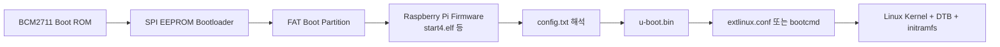

# 리눅스 부트로더와 Raspberry Pi 4 U-Boot 적용 보고서

| 항목 | 내용 |
|---|---|
| 과제 | 리눅스 부트로더 조사 및 Raspberry Pi 4 U-Boot 적용 |
| 개발 호스트 | Ubuntu/Debian 계열 Linux 데스크톱 |
| 대상 장치 | Raspberry Pi 4 Model B |
| 대상 아키텍처 | ARMv8-A/AArch64, 64비트 |
| 부트로더 | GNU GRUB, Das U-Boot |
| 디버깅 인터페이스 | 3.3V UART, 115200-8-N-1 |
| 작성일 | 2026-07-18 |
| 실제 장비 검증 | Raspberry Pi 4와 microSD 카드에서 별도 수행 필요 |

> 이 문서는 조사 내용과 실습 절차를 함께 정리한 보고서다. `make`와 SD 카드 적용 명령은 Linux 데스크톱에서 실행해야 하며, 장치명이 포함된 명령은 실제 환경에 맞게 반드시 수정해야 한다.

---

## 1. 수행 목표

본 과제의 목표는 Linux 부트로더의 역할과 설정 방법을 이해하고, Raspberry Pi 4용 U-Boot를 직접 크로스 컴파일하여 부팅 체인에 적용하는 것이다.

- 부트로더가 전원 인가 후 수행하는 기능 이해
- x86용 GRUB와 임베디드용 U-Boot 비교
- BIOS/UEFI 및 임베디드 시스템의 부트로더 저장 위치 이해
- 부트로더 설정 방법과 설정 오류의 영향 분석
- Raspberry Pi 4용 U-Boot 크로스 컴파일
- Raspberry Pi 펌웨어가 U-Boot를 먼저 실행하도록 `config.txt` 수정
- U-Boot가 Linux 커널, DTB 및 initramfs를 실행하도록 설정
- U-Boot 프롬프트 문자열 변경 및 UART에서 확인
- 실패에 대비한 백업 및 복구 절차 수립

---

## 2. 부트로더의 정의와 기본 역할

부트로더는 시스템에 전원이 공급된 후 운영체제 커널이 실행되기 전까지 동작하는 초기 소프트웨어다. CPU는 리셋 직후 미리 정해진 주소의 Boot ROM 또는 플랫폼 펌웨어를 실행하며, 이후 플랫폼의 부팅 규칙에 따라 다음 단계 부트로더를 찾아 실행한다.


### 2.1 주요 기능

| 기능 | 설명 |
|---|---|
| 실행 환경 확립 | 스택, 캐시, 클럭, DRAM 등 다음 단계 코드가 필요한 실행 환경을 준비한다. |
| 하드웨어 초기화 | Pinmux, UART, 타이머, 저장장치, 네트워크 장치 등을 초기화한다. |
| 부팅 장치 선택 | SD, eMMC, NAND, SPI NOR, USB, NVMe, 네트워크 등의 우선순위를 결정한다. |
| 운영체제 이미지 탐색 | 파티션과 파일시스템에서 커널, DTB, initramfs 또는 부팅 설정을 찾는다. |
| 메모리 적재 | 각 이미지를 충돌하지 않는 RAM 주소에 배치한다. |
| 부팅 정보 전달 | 커널 명령행과 Device Tree를 통해 콘솔, 루트파일시스템, 하드웨어 정보를 전달한다. |
| 무결성·보안 검증 | Secure Boot 구성에서는 서명 또는 해시를 검증하여 허가된 이미지만 실행한다. |
| 복구·업데이트 | UART, USB, TFTP, DFU 등을 이용한 진단, 펌웨어 갱신 및 복구 경로를 제공한다. |

### 2.2 커널, DTB, initramfs

- **Linux Kernel**: 프로세스, 메모리, 장치, 네트워크와 파일시스템을 관리하는 운영체제 핵심이다.
- **DTB(Device Tree Blob)**: ARM 보드의 CPU, 메모리 주소, 인터럽트, GPIO와 주변장치 연결 정보를 커널에 전달한다.
- **initramfs**: 실제 루트파일시스템을 마운트하기 전에 사용하는 임시 루트파일시스템이다. 저장장치·암호화·RAID 드라이버 로딩 등에 사용된다.
- **Kernel command line**: `console=`, `root=`, `rootwait`, `rw` 등 부팅 정책과 루트파일시스템 위치를 지정한다.

---

## 3. 주요 Linux 부트로더 비교

### 3.1 GNU GRUB

GRUB(GRand Unified Bootloader)은 PC와 서버에서 널리 사용되는 범용 부트로더다. BIOS와 UEFI를 지원하고 여러 커널 및 운영체제를 메뉴에서 선택할 수 있다. GNU 공식 문서는 GRUB를 다양한 아키텍처를 지원하는 유연한 부트로더로 설명하며, 현재 설정 파일은 `grub.cfg`이다. 자세한 기능과 명령은 [GNU GRUB 공식 페이지](https://www.gnu.org/software/grub/)와 [GNU GRUB Manual](https://www.gnu.org/software/grub/manual/grub/grub.html)에서 확인할 수 있다.

주요 특징은 다음과 같다.

- BIOS 및 UEFI 지원
- Linux, Windows 등 다중 운영체제 선택과 chainloading
- 파일시스템을 인식하여 커널과 initramfs 로드
- 대화형 명령행 및 복구 모드
- 모듈식 구조와 스크립트형 설정
- UUID/PARTUUID를 이용한 안정적인 루트 장치 식별

일반적인 설정 파일은 다음과 같다.

```text
/etc/default/grub        사용자가 수정하는 기본 정책
/etc/grub.d/             grub.cfg 생성 스크립트
/etc/grub.d/40_custom    사용자 메뉴 항목
/boot/grub/grub.cfg      실제 부팅 시 읽는 생성 결과
```

Ubuntu/Debian 계열에서는 일반적으로 다음과 같이 적용한다.

```bash
sudo cp -a /etc/default/grub /etc/default/grub.backup
sudo editor /etc/default/grub
sudo update-grub
```

배포판 독립적인 원래 명령은 다음과 같다.

```bash
sudo grub-mkconfig -o /boot/grub/grub.cfg
```

`grub.cfg`는 일반적으로 자동 생성되므로 직접 수정하면 다음 `update-grub` 실행 때 변경 내용이 사라질 수 있다. `/etc/default/grub` 또는 `/etc/grub.d/40_custom`을 수정하고 생성된 결과를 확인하는 것이 안전하다.

### 3.2 Das U-Boot

U-Boot는 ARM, RISC-V, PowerPC 등 다양한 임베디드 보드에서 사용하는 부트로더다. 보드별 `defconfig`, Kconfig, 환경변수와 부트 스크립트를 조합하여 동작을 설정한다. 공식 문서는 [The U-Boot Documentation](https://docs.u-boot.org/en/latest/)에서 제공한다.

주요 특징은 다음과 같다.

- 보드별 초기화 코드와 `defconfig`
- Device Tree 기반 하드웨어 기술
- SD/eMMC/NAND/SPI NOR/USB/NVMe 지원
- TFTP, DHCP, NFS 등의 네트워크 부팅 및 복구
- UART 명령 프롬프트와 환경변수
- extlinux, FIT image, EFI, 스크립트 등 다양한 부팅 방식
- `bootcmd`, `bootdelay`, `bootargs`를 통한 부팅 정책 설정

대표 명령은 다음과 같다.

```text
version                         빌드 버전 확인
bdinfo                          보드와 메모리 정보 확인
printenv                        환경변수 확인
mmc list                        MMC 장치 확인
part list mmc 0                 파티션 확인
fatls mmc 0:1 /                 FAT 파티션 파일 확인
bootflow scan -l                부팅 가능한 bootflow 검색
bootflow scan -lb               검색 결과를 출력하고 부팅 시도
run bootcmd                     기본 자동 부팅 명령 실행
```

### 3.3 GRUB와 U-Boot 차이

| 구분 | GNU GRUB | Das U-Boot |
|---|---|---|
| 주요 대상 | x86 PC, 워크스테이션, 서버 | ARM/RISC-V 기반 임베디드 보드 |
| 선행 펌웨어 | BIOS 또는 UEFI | SoC Boot ROM, SPL 또는 보드 펌웨어 |
| 핵심 목적 | 운영체제·커널 선택 및 실행 | 보드 초기화, 이미지 로딩, 진단과 복구 |
| 설정 방식 | `/etc/default/grub`, 생성 스크립트, `grub.cfg` | Kconfig/defconfig, 환경변수, Device Tree, 부트 스크립트 |
| 사용자 인터페이스 | 부팅 메뉴와 명령행 | UART/화면 명령 프롬프트와 선택적 메뉴 |
| Device Tree | ARM/임베디드 환경에서 사용 | 대부분의 현대 ARM 보드에서 핵심 요소 |
| 네트워크 부팅 | 지원 | TFTP/DHCP/NFS 등 임베디드 복구 기능이 강함 |
| 저장 위치 | ESP, BIOS Boot Partition, `/boot/grub` 등 | SPI NOR, NAND, eMMC, SD 또는 보드별 전용 영역 |

---

## 4. 부트로더의 저장 위치

부트로더는 항상 하나의 파일이나 한 위치에만 저장되는 것이 아니다. 초기 코드, 본체, 설정과 모듈이 서로 다른 위치에 존재할 수 있다.

### 4.1 x86 BIOS 시스템

```text
CPU Reset → BIOS → 디스크 초기 부트 코드 → GRUB core image → /boot/grub 모듈과 grub.cfg
```

- 초기 부트 코드는 전통적으로 MBR 영역에 존재한다.
- GPT를 사용하는 BIOS 부팅에서는 별도의 BIOS Boot Partition에 GRUB core image가 저장될 수 있다.
- GRUB 모듈과 `grub.cfg`는 일반적으로 `/boot/grub`에 저장된다.

### 4.2 x86 UEFI 시스템

```text
CPU Reset → UEFI Firmware → EFI System Partition의 *.efi → /boot/grub/grub.cfg → Kernel
```

- UEFI 실행 파일은 FAT 형식의 EFI System Partition(ESP)에 저장된다.
- 펌웨어 NVRAM의 Boot Entry가 실행할 EFI 파일 경로를 가리킨다.

### 4.3 일반 임베디드 시스템

SoC의 첫 Boot ROM은 칩 내부의 읽기 전용 메모리에 고정되어 있다. 이후 단계인 SPL과 U-Boot 본체는 보드 설계에 따라 SPI NOR, NAND, eMMC boot partition, SD 카드의 raw sector 또는 파일시스템에 저장된다.

### 4.4 Raspberry Pi 4

Raspberry Pi 4의 부팅 체인은 일반 ARM 개발 보드와 조금 다르다.



Raspberry Pi 공식 문서에 따르면 `config.txt`는 ARM CPU와 Linux가 초기화되기 전에 읽히는 설정 파일이며, Raspberry Pi OS에서는 부트 파티션이 `/boot/firmware/`에 마운트된다. `kernel=` 항목으로 펌웨어가 로드할 실행 파일을 변경할 수 있다. 자세한 항목은 [Raspberry Pi config.txt 공식 문서](https://www.raspberrypi.com/documentation/computers/config_txt.html)를 참고한다.

본 실습은 SPI EEPROM의 부트로더를 직접 수정하지 않는다. 정상 Raspberry Pi OS 부트 파티션은 유지한 채 `kernel=u-boot.bin`을 설정하여 Raspberry Pi 펌웨어와 Linux 커널 사이에 U-Boot를 삽입한다.

---

## 5. 임베디드 시스템에서 부트로더가 중요한 이유

PC는 표준화된 BIOS/UEFI가 대부분의 초기화를 제공하지만 임베디드 보드는 CPU, 메모리, 전원, 저장장치와 주변장치 구성이 제품마다 다르다. 따라서 부트로더는 보드별 하드웨어와 Linux 사이를 연결하는 핵심 계층이다.

### 5.1 성능에 미치는 영향

- 불필요한 장치 검색과 긴 `bootdelay`는 전체 부팅 시간을 증가시킨다.
- 저장장치 속도와 이미지 압축 방식은 커널 로드 시간을 바꾼다.
- 잘못된 클럭 또는 DRAM 설정은 성능 저하나 불안정을 일으킨다.
- 필요한 드라이버만 포함한 작은 부트로더는 초기화 시간을 줄일 수 있다.

### 5.2 신뢰성에 미치는 영향

- Watchdog, A/B 파티션, boot count를 사용하면 실패한 업데이트에서 자동 복구할 수 있다.
- 이미지 서명과 rollback 방지는 변조된 펌웨어 실행을 막는다.
- UART, USB, 네트워크 복구 경로는 현장에서 고장 장치를 복원할 수 있게 한다.
- 전원 차단 중 업데이트에 대비한 원자적 갱신 설계가 필요하다.

### 5.3 설정 오류로 발생하는 문제

| 오류 | 예상 증상 |
|---|---|
| 다른 보드용 U-Boot 사용 | U-Boot 진입 전 정지 또는 예외 |
| 32비트/64비트 불일치 | 실행 실패, 잘못된 예외 레벨 또는 커널 부팅 실패 |
| 잘못된 DRAM 초기화 | 메모리 오류, 무작위 정지, 반복 재부팅 |
| 잘못된 DTB | USB, Ethernet, GPIO, I2C 등 주변장치 미동작 |
| 잘못된 커널 로드 주소 | U-Boot, DTB, initramfs 간 메모리 충돌 |
| 잘못된 `root=` | `VFS: Unable to mount root fs` 및 Kernel panic |
| UART 핀/속도 오류 | 실제로 동작해도 로그를 확인하지 못함 |
| 잘못된 `bootcmd` | 자동 부팅 중단 또는 무한 반복 |
| 환경 저장 위치 오류 | 다른 파티션이나 펌웨어 영역 손상 가능 |
| 검증되지 않은 업데이트 | 원격 복구가 불가능한 장치 brick 상태 |

---

## 6. 부트로더 설정 방법과 주의사항

### 6.1 GRUB 설정 원칙

1. 현재 설정과 파티션 구조를 백업한다.
2. `/etc/default/grub` 또는 `/etc/grub.d/40_custom`을 수정한다.
3. `grub-mkconfig` 또는 배포판의 `update-grub`로 `grub.cfg`를 다시 생성한다.
4. 생성 결과에서 커널, initrd와 `root=UUID`가 올바른지 확인한다.
5. 기존 정상 커널과 복구 항목을 삭제하지 않고 재부팅한다.

### 6.2 U-Boot 설정 계층

| 계층 | 적용 시점 | 예시 |
|---|---|---|
| Kconfig/defconfig | 컴파일 전 | `CONFIG_SYS_PROMPT`, 명령어, 드라이버, 부팅 기능 |
| Device Tree | 빌드 또는 부팅 시 | UART, GPIO, 메모리, 주변장치 정보 |
| 환경변수 | 런타임 | `bootcmd`, `bootargs`, `bootdelay`, `serverip` |
| 부트 설정 파일 | 부팅 시 | `/extlinux/extlinux.conf`, `boot.scr` |
| 보드 펌웨어 설정 | U-Boot 실행 전 | Raspberry Pi의 `config.txt` |

U-Boot 환경변수는 `env set`으로 RAM에서 먼저 시험할 수 있고, `env save`를 실행해야 영구 저장된다. 저장 백엔드 위치를 확인하지 않은 상태에서 `saveenv`를 실행하면 의도하지 않은 저장 영역을 변경할 수 있으므로 본 실습에서는 기본적으로 사용하지 않는다. 환경변수 동작은 [U-Boot Environment Variables](https://docs.u-boot.org/en/latest/usage/environment.html)와 [env command](https://docs.u-boot.org/en/latest/usage/cmd/env.html)를 참고한다.

### 6.3 공통 주의사항

- 작업 전에 부트 파티션 전체를 백업한다.
- SD 카드 장치명은 크기가 아니라 `MODEL`, `SERIAL`, `TRAN`, 마운트 위치까지 확인한다.
- U-Boot, 커널과 DTB의 아키텍처를 모두 64비트로 맞춘다.
- 커널/DTB 교체 시 기존 정상 파일을 다른 이름으로 유지한다.
- UART 콘솔을 먼저 확보한 후 부팅 설정을 변경한다.
- 변경은 한 번에 하나씩 적용하고 부팅 로그와 Git commit을 남긴다.
- SD 카드 쓰기와 `sync`가 끝나기 전에 제거하거나 전원을 차단하지 않는다.
- OTP, Secure Boot key, EEPROM erase와 같은 비가역 작업은 본 실습 범위에서 수행하지 않는다.

---

## 7. Raspberry Pi 4 U-Boot 실습 환경

### 7.1 필요 장비

- Raspberry Pi 4 Model B와 안정적인 전원 공급 장치
- 정상 부팅 가능한 Raspberry Pi OS 64-bit microSD 카드
- Ubuntu/Debian Linux 데스크톱
- 3.3V TTL USB-UART 어댑터
- TX, RX, GND 연결용 점퍼선
- microSD 카드 리더

### 7.2 UART 연결

| Raspberry Pi 4 | 물리 핀 | USB-UART |
|---|---:|---|
| GND | 6 | GND |
| GPIO14/TXD | 8 | RXD |
| GPIO15/RXD | 10 | TXD |

```text
Pi TXD(GPIO14) ─────────→ USB-UART RXD
Pi RXD(GPIO15) ←───────── USB-UART TXD
Pi GND         ────────── USB-UART GND
```

> Raspberry Pi GPIO는 3.3V 논리 레벨이다. 5V TTL 신호를 GPIO14/15에 직접 연결하지 않는다. USB-UART 어댑터의 VCC 핀으로 Raspberry Pi에 전원을 공급하지 않는다.

터미널 설정은 `115200 baud, 8 data bits, no parity, 1 stop bit, no flow control`이다.

```bash
sudo apt install -y minicom
sudo minicom -D /dev/ttyUSB0 -b 115200
```

---

## 8. Raspberry Pi 4용 U-Boot 크로스 컴파일

U-Boot 공식 빌드 문서는 ARMv8 크로스 컴파일러로 `gcc-aarch64-linux-gnu`를 사용하고 `CROSS_COMPILE=aarch64-linux-gnu-`를 지정하는 방법을 설명한다. 자세한 내용은 [Building U-Boot with GCC](https://docs.u-boot.org/en/stable/build/gcc.html)를 참고한다.

### 8.1 빌드 도구 설치

```bash
sudo apt update
sudo apt install -y \
  git build-essential gcc-aarch64-linux-gnu \
  bc bison flex libssl-dev libgnutls28-dev \
  device-tree-compiler libncurses-dev python3 \
  python3-dev python3-setuptools python3-pyelftools swig
```

툴체인을 확인한다.

```bash
aarch64-linux-gnu-gcc --version
```

### 8.2 U-Boot 소스 받기

```bash
git clone https://source.denx.de/u-boot/u-boot.git
cd u-boot
git tag --sort=-v:refname | head -n 10
```

빌드 재현성을 위해 `master`를 그대로 사용하지 않고 실습에서 사용할 안정 태그를 선택하여 기록한다.

```bash
git checkout <선택한_안정_태그>
git describe --tags --always --dirty
```

### 8.3 Raspberry Pi 4 설정 선택

[U-Boot Raspberry Pi 공식 보드 문서](https://docs.u-boot.org/en/latest/board/broadcom/raspberrypi.html)는 Raspberry Pi 4 64비트용으로 다음 두 설정을 제공한다.

| 설정 | 용도 |
|---|---|
| `rpi_4_defconfig` | Raspberry Pi 4B 64비트 전용 |
| `rpi_arm64_defconfig` | Pi 3/4/400/CM 계열 공용, 펌웨어가 전달한 Device Tree 사용 |

본 실습은 Raspberry Pi 4 전용 설정을 사용한다.

```bash
make distclean
make rpi_4_defconfig
```

공용 ARM64 바이너리가 필요한 경우에만 다음을 대신 사용한다.

```bash
make distclean
make rpi_arm64_defconfig
```

### 8.4 U-Boot 프롬프트 변경

Kconfig의 `SYS_PROMPT` 값을 원하는 문자열로 변경한다.

```bash
scripts/config --set-str SYS_PROMPT "SANGJIN-RPI4=> "
scripts/config --set-val BOOTDELAY 3
make olddefconfig
```

변경값을 확인한다.

```bash
grep -E '^CONFIG_SYS_PROMPT=|^CONFIG_BOOTDELAY=' .config
```

예상 결과:

```text
CONFIG_SYS_PROMPT="SANGJIN-RPI4=> "
CONFIG_BOOTDELAY=3
```

사용하는 U-Boot 버전에서 Kconfig symbol이나 메뉴 위치가 변경된 경우 다음 방식으로 검색한다.

```bash
make menuconfig
```

`menuconfig`에서 `/`를 눌러 `SYS_PROMPT`를 검색하고 해당 메뉴에서 변경한 후 저장한다.

### 8.5 컴파일

```bash
make CROSS_COMPILE=aarch64-linux-gnu- -j"$(nproc)"
```

생성 파일을 확인한다.

```bash
file u-boot.bin
ls -lh u-boot u-boot.bin
```

실습 기록을 위해 빌드 정보와 해시를 남긴다.

```bash
git describe --tags --always --dirty
sha256sum u-boot.bin
```

---

## 9. microSD 카드에 U-Boot 적용

### 9.1 장치 식별

SD 카드를 연결하기 전후에 `lsblk` 결과를 비교한다.

```bash
lsblk -o NAME,PATH,SIZE,MODEL,SERIAL,TRAN,FSTYPE,LABEL,PARTUUID,MOUNTPOINTS
```

이 보고서의 `/dev/sdX1`은 예시다. `/dev/sda1`처럼 고정해서 복사하면 시스템 디스크를 손상할 수 있다.

```bash
export BOOT_DEV=/dev/sdX1
sudo mkdir -p /mnt/rpi-boot
sudo mount "$BOOT_DEV" /mnt/rpi-boot
```

마운트한 파티션에 기존 Raspberry Pi 부팅 파일과 `config.txt`가 있는지 확인한다.

```bash
findmnt /mnt/rpi-boot
ls -la /mnt/rpi-boot
test -f /mnt/rpi-boot/config.txt
```

### 9.2 백업

```bash
sudo cp -a /mnt/rpi-boot/config.txt \
  /mnt/rpi-boot/config.txt.pre-uboot

sudo mkdir -p /mnt/rpi-boot/pre-uboot-backup
sudo cp -a /mnt/rpi-boot/kernel8.img \
  /mnt/rpi-boot/bcm2711-rpi-4-b.dtb \
  /mnt/rpi-boot/pre-uboot-backup/
```

부트 파티션 전체를 호스트 PC의 별도 디스크에도 백업하는 것이 가장 안전하다.

### 9.3 U-Boot 복사

U-Boot 소스 디렉터리에서 실행한다.

```bash
sudo cp -a u-boot.bin /mnt/rpi-boot/u-boot.bin
sudo sync
```

### 9.4 `config.txt` 수정

기존 `config.txt`의 적절한 섹션에 다음을 추가한다.

```ini
[pi4]
arm_64bit=1
enable_uart=1
uart_2ndstage=1
kernel=u-boot.bin

[all]
```

| 항목 | 의미 |
|---|---|
| `arm_64bit=1` | 펌웨어가 다음 실행 파일을 AArch64 모드에서 시작하도록 설정 |
| `enable_uart=1` | 기본 UART 활성화 |
| `uart_2ndstage=1` | Raspberry Pi 2단계 펌웨어 UART 디버그 로그 활성화 |
| `kernel=u-boot.bin` | 기본 Linux 커널 대신 U-Boot 바이너리를 먼저 실행 |

Raspberry Pi 4는 공식 문서상 64비트 모드가 기본이지만, 실습 의도를 명확히 하고 U-Boot 빌드와 일치시키기 위해 `arm_64bit=1`을 명시한다.

---

## 10. U-Boot에서 Linux 커널 부팅

### 10.1 extlinux 설정

U-Boot의 Standard Boot는 `/extlinux/extlinux.conf` 또는 `/boot/extlinux/extlinux.conf`를 검색할 수 있다. 공식 형식은 [U-Boot Extlinux Bootmeth](https://docs.u-boot.org/en/stable/develop/bootstd/extlinux.html)를 참고한다.

부트 파티션에 디렉터리와 설정 파일을 생성한다.

```bash
sudo mkdir -p /mnt/rpi-boot/extlinux
sudo editor /mnt/rpi-boot/extlinux/extlinux.conf
```

예시:

```text
default raspberrypi4
menu title Raspberry Pi 4 U-Boot
timeout 30

label raspberrypi4
    menu label Raspberry Pi OS 64-bit
    linux /kernel8.img
    fdt /bcm2711-rpi-4-b.dtb
    append console=serial0,115200 console=tty1 root=PARTUUID=<ROOT_PARTUUID> rootfstype=ext4 rootwait rw
```

`<ROOT_PARTUUID>`는 추측하지 말고 실제 루트 파티션에서 확인한다.

```bash
lsblk -o NAME,FSTYPE,LABEL,PARTUUID,MOUNTPOINTS
blkid
```

initramfs가 필요한 환경에서는 해당 파일을 부트 파티션에 유지하고 엔트리를 추가한다.

```text
    initrd /initramfs8
```

### 10.2 주요 커널 인자

| 인자 | 의미 |
|---|---|
| `console=serial0,115200` | UART 콘솔에서 커널 로그와 로그인 콘솔 사용 |
| `console=tty1` | 로컬 화면 콘솔 사용 |
| `root=PARTUUID=...` | Linux 루트 파티션 지정 |
| `rootfstype=ext4` | 루트파일시스템 형식 지정 |
| `rootwait` | SD/eMMC 장치가 준비될 때까지 대기 |
| `rw` | 루트파일시스템을 읽기·쓰기 모드로 마운트 요청 |

### 10.3 마운트 해제

```bash
sudo sync
sudo umount /mnt/rpi-boot
```

`umount`가 성공한 뒤 SD 카드를 제거한다.

---

## 11. 부팅 및 프롬프트 확인

### 11.1 예상 부팅 흐름

```text
전원 인가
→ BCM2711 Boot ROM
→ SPI EEPROM bootloader
→ FAT 부트 파티션의 Raspberry Pi firmware
→ config.txt 해석
→ u-boot.bin 실행
→ U-Boot 프롬프트/자동 부팅 대기
→ extlinux.conf 검색
→ kernel8.img + DTB + initramfs 로드
→ Linux kernel 실행
→ root filesystem 마운트
→ systemd 실행
```

### 11.2 예상 UART 출력

```text
U-Boot 20xx.xx (...)

DRAM:  ...
MMC:   ...
Hit any key to stop autoboot:  3
SANGJIN-RPI4=>
```

카운트다운 중 키를 눌러 자동 부팅을 중단하고 변경한 프롬프트를 확인한다.

```text
version
bdinfo
mmc list
part list mmc 0
fatls mmc 0:1 /
printenv bootcmd bootargs bootdelay
bootflow scan -l
bootflow scan -lb
```

`bootflow scan -lb`는 부팅 가능한 구성을 나열한 뒤 해당 bootflow로 부팅을 시도한다. 자동 부팅이 실패할 경우 먼저 `bootflow scan -l`로 검색된 파일과 파티션을 확인한다.

---

## 12. 문제 해결과 복구

### 12.1 증상별 점검표

| 증상 | 확인 내용 |
|---|---|
| 전원은 들어오지만 UART 출력 없음 | TX/RX 교차, 공통 GND, 3.3V 레벨, 115200-8-N-1, `enable_uart=1` |
| Raspberry Pi 펌웨어 로그만 출력 | `u-boot.bin` 존재 여부, 파일 손상, `kernel=u-boot.bin`, 64비트 빌드 확인 |
| U-Boot 진입 후 SD 카드가 보이지 않음 | `mmc list`, `mmc dev`, 전원과 SD 카드 호환성 확인 |
| `extlinux.conf`를 찾지 못함 | `/extlinux/extlinux.conf` 경로, FAT/ext4 파티션 번호, 파일명 대소문자 확인 |
| 커널 파일을 찾지 못함 | `fatls mmc 0:1 /`, extlinux의 `linux` 경로 확인 |
| `Bad Linux ARM64 Image magic` | `kernel8.img` 파일과 AArch64 빌드 여부 확인 |
| DTB 로드 오류 | `bcm2711-rpi-4-b.dtb` 존재 여부와 커널 버전 호환성 확인 |
| `VFS: Unable to mount root fs` | `PARTUUID`, `rootfstype`, `rootwait`, 저장장치 드라이버/initramfs 확인 |
| Linux는 부팅되나 USB/Ethernet 미동작 | DTB와 커널의 출처·버전 일치 여부 확인 |

### 12.2 빠른 복구

1. Raspberry Pi 전원을 끈다.
2. SD 카드를 Linux PC에 연결하고 부트 파티션을 마운트한다.
3. `config.txt.pre-uboot`를 원래 `config.txt`로 복구한다.
4. `kernel=u-boot.bin` 설정이 제거되었는지 확인한다.
5. 정상 `kernel8.img`와 DTB가 유지되는지 확인한다.
6. `sync` 후 마운트 해제하고 다시 부팅한다.

```bash
sudo cp -a /mnt/rpi-boot/config.txt.pre-uboot \
  /mnt/rpi-boot/config.txt
sudo sync
sudo umount /mnt/rpi-boot
```

이 실습에서는 EEPROM을 수정하지 않으므로 SD 카드의 `config.txt`를 복원하면 기존 Raspberry Pi OS 부팅 체인으로 되돌릴 수 있다.

---

## 13. 실습 결과 기록 양식

다음 표는 실제 Linux PC와 Raspberry Pi 4에서 실습한 뒤 채운다. 하드웨어에서 수행하지 않은 항목을 임의로 성공 처리하지 않는다.

| 확인 항목 | 결과 | 증빙 |
|---|---|---|
| U-Boot 소스 태그/commit | 미수행 | `git describe` 출력 첨부 |
| `rpi_4_defconfig` 생성 | 미수행 | `.config` 일부 첨부 |
| 프롬프트 변경 확인 | 미수행 | `CONFIG_SYS_PROMPT` 출력 첨부 |
| `u-boot.bin` 빌드 | 미수행 | 빌드 로그와 SHA-256 첨부 |
| SD 카드 백업 | 미수행 | 백업 파일 목록 첨부 |
| Raspberry Pi 펌웨어 로그 | 미수행 | UART 캡처 첨부 |
| U-Boot 프롬프트 출력 | 미수행 | `SANGJIN-RPI4=>` 사진/로그 첨부 |
| MMC 및 파티션 인식 | 미수행 | `mmc list`, `part list` 첨부 |
| extlinux bootflow 검색 | 미수행 | `bootflow scan -l` 첨부 |
| Linux 커널 부팅 | 미수행 | `uname -a`, `cat /proc/cmdline` 첨부 |
| 재부팅 후 재현 | 미수행 | 2회 이상 부팅 결과 기록 |

### 13.1 Linux 부팅 후 확인 명령

```bash
uname -a
cat /proc/cmdline
cat /proc/device-tree/model
lsblk -o NAME,FSTYPE,LABEL,PARTUUID,MOUNTPOINTS
dmesg | grep -Ei 'serial|mmc|bcm|raspberry'
```

---

## 14. 결과 분석

### 14.1 부트로더는 임베디드 시스템에서 어떤 핵심 역할을 하는가?

부트로더는 보드 고유의 하드웨어를 Linux가 실행 가능한 상태로 만들고, 커널과 하드웨어 설명인 Device Tree를 연결한다. 또한 정상 부팅이 불가능할 때 UART와 네트워크 등을 이용해 진단하고 복구할 수 있는 최소 실행 환경을 제공한다.

### 14.2 다양한 부트로더의 특징과 차이점은 무엇인가?

GRUB는 BIOS/UEFI 이후에 실행되어 여러 PC 운영체제와 커널을 선택하는 기능이 강하다. U-Boot는 표준 펌웨어가 없는 보드에서 하드웨어 초기화, 저장장치 제어, 네트워크 부팅과 장치별 복구를 수행하는 데 초점이 있다. Raspberry Pi 4 실습에서는 전용 EEPROM과 Raspberry Pi 펌웨어가 초기 단계를 담당하고 U-Boot가 그 다음 단계에서 Linux 로딩과 사용자 제어 환경을 제공한다.

### 14.3 설정 변경이 성능과 신뢰성에 미치는 영향은 무엇인가?

부팅 장치 탐색 순서, 지연시간, 이미지 형식과 장치 초기화 범위는 부팅 시간을 좌우한다. 반면 너무 공격적으로 초기화를 생략하거나 검증되지 않은 환경변수를 저장하면 특정 하드웨어가 인식되지 않거나 복구 불가능한 상태가 될 수 있다. 운영 제품에서는 빠른 부팅뿐 아니라 A/B 업데이트, Watchdog, 이미지 검증과 복구 콘솔을 함께 설계해야 한다.

### 14.4 실제 장비에 올리는 과정은 어떻게 구성되는가?

```text
보드와 부팅 체인 조사
→ 아키텍처에 맞는 크로스 툴체인 설치
→ 보드 defconfig 선택
→ Kconfig와 프롬프트 수정
→ U-Boot 크로스 컴파일
→ 결과물 해시와 빌드 버전 기록
→ 부트 파티션 백업
→ u-boot.bin과 부팅 설정 배치
→ UART에서 U-Boot 실행 확인
→ 커널·DTB·rootfs 연결
→ Linux 부팅과 주변장치 검증
→ 실패 복구 및 재현 시험
```

---

## 15. 결론

부트로더는 단순히 Linux 커널 파일을 실행하는 프로그램이 아니라, 전원 인가 직후의 제한된 하드웨어 상태를 운영체제가 실행 가능한 상태로 전환하는 핵심 시스템 소프트웨어다. GRUB는 PC의 BIOS/UEFI 환경에서 운영체제와 커널을 선택하는 역할에 강하며, U-Boot는 보드별 초기화, Device Tree, 다양한 저장장치와 복구 인터페이스가 중요한 임베디드 환경에 적합하다.

Raspberry Pi 4에서는 BCM2711 Boot ROM과 SPI EEPROM 부트로더, Raspberry Pi 펌웨어가 먼저 실행된다. `config.txt`의 `kernel=u-boot.bin` 설정을 사용하면 기존 EEPROM을 변경하지 않고 U-Boot를 Linux 앞 단계에 배치할 수 있다. 이후 U-Boot가 `extlinux.conf`를 검색하여 Linux 커널, DTB와 initramfs를 로드한다.

U-Boot 프롬프트는 `CONFIG_SYS_PROMPT`를 변경하고 다시 빌드함으로써 수정할 수 있다. 단, 실제 완료 판정은 Raspberry Pi 4의 UART에서 변경된 프롬프트와 Linux 부팅을 확인하고, 빌드 태그·해시·로그를 기록한 뒤 내려야 한다.

---

## 16. 참고 자료

### 16.1 공식·1차 자료

- [GNU GRUB 공식 페이지](https://www.gnu.org/software/grub/)
- [GNU GRUB Manual](https://www.gnu.org/software/grub/manual/grub/grub.html)
- [The U-Boot Documentation](https://docs.u-boot.org/en/latest/)
- [Building U-Boot with GCC](https://docs.u-boot.org/en/stable/build/gcc.html)
- [U-Boot Raspberry Pi Board Documentation](https://docs.u-boot.org/en/latest/board/broadcom/raspberrypi.html)
- [U-Boot Extlinux Bootmeth](https://docs.u-boot.org/en/stable/develop/bootstd/extlinux.html)
- [U-Boot Environment Variables](https://docs.u-boot.org/en/latest/usage/environment.html)
- [Raspberry Pi config.txt Documentation](https://www.raspberrypi.com/documentation/computers/config_txt.html)
- [Raspberry Pi Bootloader Configuration](https://www.raspberrypi.com/documentation/computers/raspberry-pi.html#raspberry-pi-bootloader-configuration)

### 16.2 과제에서 제시된 추가 참고 자료

- [ARM CPU 기반의 Embedded Linux 구축하기](https://jeongzero.oopy.io/b7ae5e74-addc-438a-8a25-71b0ad02934e)
- [Raspberry Pi 4 U-Boot 관련 참고 글](https://wearedev.cafe24.com/284)

> 블로그 자료는 실습 흐름을 이해하는 보조 자료로 사용하고, 명령과 설정값은 U-Boot 및 Raspberry Pi 공식 문서를 우선 기준으로 확인한다.
