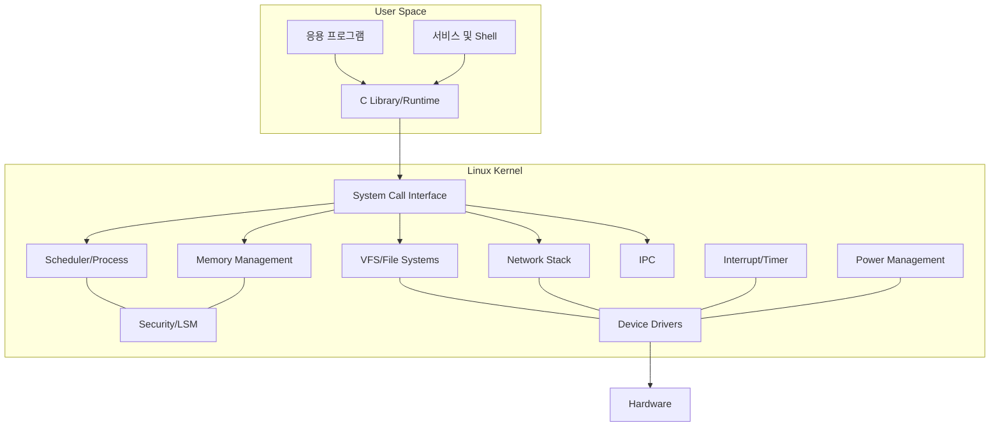

# Linux 커널 구성과 Raspberry Pi 4 커널 최적화 보고서

| 항목 | 내용 |
|---|---|
| 과제 | Linux 커널 구성요소 조사 및 임베디드 커널 커스터마이징 |
| 개발 호스트 | Ubuntu/Debian 계열 Linux 데스크톱 |
| 대상 장치 | Raspberry Pi 4 Model B |
| 대상 CPU | Broadcom BCM2711, ARM Cortex-A72, AArch64 |
| 커널 소스 | Raspberry Pi Linux downstream kernel |
| 크로스 컴파일러 | `aarch64-linux-gnu-` |
| 설정 도구 | Kconfig `menuconfig` |
| 작성일 | 2026-07-18 |
| 실제 장비 검증 | Raspberry Pi 4와 microSD 카드에서 별도 수행 필요 |

> 이 문서는 조사 내용과 재현 가능한 실습 절차를 함께 정리한 보고서다. 커널 설정과 빌드는 Linux 데스크톱에서 수행할 수 있지만 실제 부팅, 장치 기능과 성능은 Raspberry Pi 4에서 검증해야 한다. 장치명이 포함된 명령은 실제 환경에 맞게 수정한다.

---

## 1. 수행 목표

본 과제의 목표는 Linux 커널의 주요 구성요소와 기능을 이해하고, Raspberry Pi 4의 요구사항에 맞게 커널 설정을 변경하여 ARM64 커널 이미지, 모듈과 Device Tree를 빌드·배포하는 것이다.

- Linux 커널이 제공하는 기본 기능 이해
- 프로세스 스케줄러, 메모리, VFS, 네트워크, 보안과 드라이버 구조 이해
- 커널 모듈의 역할과 관련 명령 습득
- 임베디드 시스템에서 커널 최적화가 필요한 이유 분석
- 커널 이미지·메모리·부팅시간·공격 표면의 관계 이해
- Raspberry Pi 4 기본 설정 `bcm2711_defconfig` 적용
- `make menuconfig`를 이용한 커널 커스터마이징
- 변경한 `.config`와 간소화된 `defconfig` 저장
- AArch64 크로스 컴파일로 커널, 모듈, DTB와 Overlay 생성
- microSD 카드에 기존 커널과 분리하여 설치
- 커널 command line 추가·삭제 및 영향 분석
- 최적화 전후 크기, 부팅시간, 메모리와 장치 기능 비교
- 부팅 실패에 대비한 백업과 복구 절차 준비

---

## 2. Linux 커널의 역할

Linux 커널은 사용자 프로그램과 하드웨어 사이에서 CPU, 메모리, 저장장치, 네트워크와 장치를 관리하는 운영체제의 핵심이다.



### 2.1 커널이 제공하는 기본 기능

| 기능 | 설명 |
|---|---|
| 프로세스 관리 | 태스크 생성·종료, 상태 전환, 문맥 교환과 CPU 스케줄링 |
| 메모리 관리 | 가상 주소 공간, 페이지 할당·회수, page cache, mmap과 메모리 보호 |
| 파일시스템 | VFS를 통한 파일·디렉터리·mount와 여러 파일시스템의 공통 인터페이스 |
| 장치 관리 | 드라이버를 통한 GPIO, UART, I2C, SPI, USB, MMC, 네트워크 장치 제어 |
| 네트워크 | socket, Ethernet, IPv4/IPv6, TCP/UDP, routing, filtering |
| 시스템 콜 | 사용자 프로그램에 커널 기능을 제공하는 보호된 진입점 |
| IPC | signal, pipe, shared memory, semaphore, message queue와 futex |
| 보안 | UID/GID, capability, 권한 검사, LSM과 namespace/cgroup 연계 |
| 인터럽트·타이머 | 하드웨어 이벤트, 시간 관리, timeout과 주기 작업 처리 |
| 전원 관리 | CPUFreq, idle state, runtime PM, suspend와 wake-up |
| 모듈 관리 | 실행 중 드라이버와 기능을 동적으로 적재·제거 |
| 진단 | printk, procfs, sysfs, tracepoint, ftrace와 crash 정보 제공 |

Linux 커널 공식 코드는 [The Linux Kernel Archives](https://www.kernel.org/)에서 제공되며, 커널 내부 API와 subsystem 문서는 [Linux Kernel Documentation](https://docs.kernel.org/)에서 확인할 수 있다.

---

## 3. 주요 커널 구성요소

### 3.1 프로세스와 스케줄러

스케줄러는 실행 가능한 태스크 중 다음에 CPU를 사용할 태스크를 선택한다.

- 프로세스·스레드 상태와 runqueue 관리
- 일반 태스크의 공정한 CPU 배분
- 멀티코어 load balancing
- affinity와 CPU 격리
- 실시간 정책 `SCHED_FIFO`, `SCHED_RR`
- deadline 정책과 preemption
- cgroup 기반 CPU 자원 제어

실시간 정책은 응답성을 높일 수 있지만 우선순위와 실행시간을 잘못 설정하면 일반 태스크가 실행되지 못하는 starvation을 일으킬 수 있다.

### 3.2 메모리 관리자

```text
사용자 가상 주소
  → MMU와 Page Table
  → Physical Page
  → DRAM
```

주요 기능:

- 프로세스별 가상 주소 공간과 보호
- buddy allocator와 slab 계열 allocator
- page cache와 write-back
- anonymous/file-backed memory
- 공유 메모리와 `mmap()`
- reclaim, swap과 OOM Killer
- DMA mapping과 CMA

임베디드 장치에서는 RAM 용량, GPU/CMA 예약, swap 사용 여부와 OOM 정책을 함께 검토해야 한다. 기능을 config에서 제거했다고 항상 큰 런타임 메모리가 절약되는 것은 아니므로 `/proc/meminfo`, slab, reserved memory를 실제 측정한다.

### 3.3 VFS와 파일시스템

VFS(Virtual File System)는 서로 다른 파일시스템을 `open`, `read`, `write`, `stat`, `mount` 같은 공통 인터페이스로 제공한다.

```text
Application
  → System Call
  → VFS
  ├─ ext4
  ├─ vfat
  ├─ tmpfs
  ├─ procfs
  ├─ sysfs
  └─ NFS
```

| 파일시스템 | 임베디드 용도 |
|---|---|
| ext4 | Raspberry Pi OS RootFS |
| vfat | Raspberry Pi 부트 파티션 |
| procfs | 프로세스와 커널 상태 노출 |
| sysfs | 장치, driver, bus와 class 정보 노출 |
| tmpfs | RAM 기반 임시 파일 |
| devtmpfs | `/dev` 장치 노드 기반 제공 |
| overlayfs | 읽기 전용 RootFS 위 writable layer 구성 |
| NFS | 개발 단계의 네트워크 RootFS |

루트파일시스템 드라이버가 initramfs에 없으면 커널에 `y`로 내장해야 한다.

### 3.4 네트워크 스택

Linux 네트워크 subsystem은 다음 계층을 처리한다.

- network device와 driver
- Ethernet과 Wi-Fi
- ARP/NDP
- IPv4/IPv6
- TCP/UDP/ICMP
- socket API
- routing, bridge, VLAN과 tunnel
- Netfilter와 firewall

사용하지 않는 프로토콜을 제거하면 이미지 크기와 공격 표면을 줄일 수 있지만 DHCP, DNS, container, VPN, IPv6 또는 원격 복구 요구를 누락하지 않아야 한다.

### 3.5 장치 드라이버

장치 드라이버는 kernel subsystem과 실제 하드웨어를 연결한다.

Raspberry Pi 4에서 주요 범주는 다음과 같다.

- MMC/SDHCI와 microSD
- PCIe와 USB host
- Ethernet 및 Wi-Fi
- GPIO, pinctrl
- UART
- I2C, SPI와 PWM
- DRM/KMS와 HDMI
- camera/media
- thermal sensor와 watchdog

커널 설정값은 일반적으로 세 상태를 갖는다.

```text
CONFIG_FEATURE=y   Kernel image에 내장
CONFIG_FEATURE=m   Loadable kernel module로 빌드
# CONFIG_FEATURE is not set   기능 제외
```

### 3.6 Device Tree

ARM 임베디드 시스템은 Device Tree를 통해 보드의 하드웨어 구성을 커널에 전달한다.

Device Tree가 기술하는 정보:

- CPU, RAM과 reserved memory
- peripheral register 주소
- interrupt controller와 IRQ
- clock, reset과 power domain
- GPIO와 pinctrl
- I2C/SPI/UART bus와 하위 장치
- driver matching을 위한 `compatible`
- 장치 활성 상태 `status`

Raspberry Pi 4는 커널뿐 아니라 `bcm2711-rpi-4-b.dtb`와 필요한 Overlay를 함께 설치해야 한다. 커널과 호환되지 않는 DTB는 장치 미인식을 일으킬 수 있다.

### 3.7 시스템 콜

사용자 프로그램은 시스템 콜로 커널 기능을 요청한다.

```text
openat()  read()  write()  mmap()  ioctl()
socket()  fork()  clone()  execve()  futex()
```

시스템 콜 경계에서 사용자 포인터와 권한이 검사된다. 커널 config를 줄일 때 userspace가 요구하는 namespace, seccomp, cgroup, IPC 또는 filesystem 기능까지 제거하지 않아야 한다.

### 3.8 인터럽트와 타이머

```text
Hardware Event
  → Interrupt Controller
  → IRQ Handler
  → Deferred Work/Thread
  → Driver/Process Wake-up
```

타이머와 clocksource는 scheduling, timeout, networking과 timestamp에 사용된다. timer frequency와 preemption 설정은 응답성과 overhead 사이의 trade-off가 있다.

### 3.9 보안 subsystem

- UNIX permissions와 capability
- Linux Security Modules(LSM)
- seccomp
- namespace와 cgroup
- key management
- module signature와 kernel lockdown
- read-only data와 exploit mitigation

사용하지 않는 기능을 제거하면 공격 표면이 줄어들 수 있지만 제품의 sandbox, container와 보안 정책에 필요한 기능까지 제거해서는 안 된다.

---

## 4. Kernel Module

커널 모듈은 실행 중인 커널에 추가·제거할 수 있는 object로 일반적으로 `.ko` 확장자를 사용한다.

### 4.1 관리 명령

| 명령 | 기능 |
|---|---|
| `lsmod` | 현재 적재된 모듈 표시 |
| `modinfo <name>` | module metadata, alias, parameter, license 확인 |
| `modprobe <name>` | 의존성, alias와 설정을 처리하며 모듈 적재 |
| `insmod <file.ko>` | 특정 `.ko` 파일 직접 적재, 의존성 자동 처리 없음 |
| `rmmod <name>` | 사용 중이 아닌 모듈 제거 |
| `modprobe -r <name>` | 의존성을 고려해 제거 |
| `depmod -a` | `/lib/modules/<release>` 의존성 정보 생성 |
| `dmesg` | 적재·초기화 오류 확인 |

```bash
uname -r
lsmod
modinfo brcmfmac
sudo modprobe i2c-dev
lsmod | grep i2c_dev
sudo modprobe -r i2c-dev
journalctl -k -b
```

### 4.2 내장과 모듈 비교

| 구분 | 내장 `y` | 모듈 `m` |
|---|---|---|
| 초기 부팅 사용 | 즉시 사용 가능 | 모듈 적재 필요 |
| 커널 이미지 | 포함되어 크기 증가 | 기본 이미지 밖에 위치 |
| 실행 중 제거 | 불가능 | 사용 중이 아니면 가능 |
| 배포 파일 | Kernel image | `.ko`, dependency metadata 필요 |
| RootFS 이전에 필요 | 적합 | initramfs에 포함해야 할 수 있음 |
| 선택적 장치 | 항상 포함 | 필요할 때 적재 가능 |

microSD에서 RootFS를 직접 mount하려면 MMC/SDHCI, block layer와 ext4가 커널에 내장되거나 initramfs에서 먼저 적재되어야 한다.

### 4.3 모듈 일치성

모듈은 빌드한 커널 release와 ABI가 맞아야 한다.

```bash
uname -r
modinfo <module> | grep vermagic
make -s kernelrelease
```

커널 이미지만 교체하고 `/lib/modules/<kernelrelease>`를 설치하지 않으면 `Module not found`, `invalid module format`, `Unknown symbol` 오류가 발생할 수 있다.

---

## 5. 커널 최적화의 목적과 중요성

커널 최적화는 무조건 기능을 많이 제거하는 작업이 아니라 제품 요구사항을 명시하고 그 요구사항에 맞게 기능, driver, 보안, 진단과 자원 정책을 조정하는 과정이다.

### 5.1 주요 목적

- 불필요한 driver와 protocol 제거
- kernel image와 module 저장공간 감소
- 부팅 시 불필요한 probe와 초기화 감소
- 커널 상주 메모리와 reserved memory 조정
- 공격 표면 축소
- 실제 보드에 필요한 driver 추가·내장
- preemption, tick, CPUFreq와 power policy 조정
- 제품별 설정의 재현성과 검증 범위 향상

### 5.2 임베디드 시스템에서 중요한 이유

| 제약 또는 요구 | 최적화 방향 |
|---|---|
| 제한된 flash | image/module/debug artifact 분리, 사용하지 않는 기능 제거 |
| 제한된 RAM | memory reservation, slab, buffer와 subsystem 규모 측정·조정 |
| 빠른 부팅 | boot graph 측정, 불필요 probe와 timeout 제거, 필수 driver 내장 |
| 낮은 전력 | CPUFreq, cpuidle, runtime PM과 wake source 조정 |
| 일정한 응답성 | preemption, IRQ affinity와 scheduling 정책 검토 |
| 높은 신뢰성 | 검증된 기능, watchdog, read-only RootFS와 복구 kernel 유지 |
| 보안 | 사용하지 않는 interface 제거, signature와 mitigation 유지 |
| 장기 유지보수 | LTS 기반, config와 patch의 version 관리 |

### 5.3 성능에 미치는 영향

최적화된 커널은 다음 효과를 낼 수 있다.

- 작은 image로 storage read와 decompression 시간 감소
- 불필요한 device probe와 timeout 감소
- memory pressure 감소
- scheduling/preemption 조정으로 latency 개선
- 적절한 CPUFreq/idle 설정으로 성능 또는 전력 효율 개선

그러나 부팅시간은 kernel만으로 결정되지 않는다. Raspberry Pi firmware, SD 카드, driver probe, filesystem, initramfs와 systemd service 시간이 모두 포함된다. 기능 제거 후 실제 boot chart와 장치 시험 없이 성능 개선을 단정하면 안 된다.

---

## 6. 커널 최적화의 장단점

### 6.1 장점

- Kernel image와 module tree 크기 감소
- RAM과 저장공간 절약 가능
- 불필요한 장치 검색과 초기화 감소
- 부팅시간 개선 가능
- 사용하지 않는 interface 제거로 공격 표면 축소
- 제품 기능과 hardware에 맞는 config 고정
- 검증 대상 범위 축소

### 6.2 단점과 잠재 문제

- 필요한 driver 또는 dependency까지 제거할 위험
- 다른 revision이나 향후 장치가 지원되지 않을 수 있음
- debug/tracing 제거로 현장 장애 분석이 어려워짐
- custom kernel patch와 config 유지보수 부담
- upstream/Raspberry Pi OS update를 그대로 적용하기 어려움
- 작은 image가 반드시 빠른 runtime을 의미하지 않음
- 지나친 power saving이 latency를 높일 수 있음
- 보안 기능 제거가 image는 줄여도 위험을 증가시킬 수 있음

---

## 7. 최적화 시 고려해야 할 요소

### 7.1 Hardware와 부팅 필수 기능

- ARM64와 BCM2711 platform
- microSD 또는 실제 boot/root device
- block layer, MMC와 SDHCI
- RootFS filesystem(ext4 등)
- devtmpfs, procfs, sysfs
- serial 또는 display console
- Device Tree support
- clock, interrupt controller와 timer

### 7.2 제품 기능

- Ethernet, Wi-Fi와 Bluetooth
- USB host/device와 필요한 class driver
- GPIO, I2C, SPI, PWM
- audio, display, camera와 media
- watchdog, RTC와 hardware monitor
- container/namespace/cgroup
- encryption, VPN와 firewall

### 7.3 성능·실시간성

- Preemption model
- timer frequency
- CPUFreq governor와 cpuidle
- IRQ affinity
- scheduler class와 priority
- memory reclaim, swap와 CMA

### 7.4 진단과 유지보수

- UART console
- printk와 적절한 log buffer
- debug symbols는 별도 보관 가능
- ftrace/perf/tracepoint 유지 여부
- pstore 또는 crash dump
- module support와 field update 전략

### 7.5 보안

- module loading 허용 여부
- module signature
- LSM, seccomp와 capability
- network protocol과 debug interface
- kernel hardening option
- Secure Boot chain과 image signature

---

## 8. 커널 최적화 기본 절차


1. Hardware와 software 요구사항 표를 작성한다.
2. stock kernel의 image, module, boot time, memory와 모든 장치 동작을 측정한다.
3. Raspberry Pi 기본 defconfig에서 시작한다.
4. 한 번에 소수의 config만 변경한다.
5. `.config`, source commit과 build command를 저장한다.
6. kernel, module, DTB를 같은 source/config로 함께 빌드한다.
7. 기존 kernel을 덮어쓰지 않고 별도 이름으로 설치한다.
8. UART를 확보한 뒤 boot와 hardware regression test를 수행한다.
9. 크기뿐 아니라 boot time, memory, power와 기능을 비교한다.
10. 실패 config와 원인을 기록하고 반복한다.

---

## 9. 제거·모듈화·유지 후보

### 9.1 제거를 검토할 수 있는 기능

제품에서 사용하지 않는 것이 요구사항과 시험으로 확인된 경우에만 검토한다.

- 사용하지 않는 filesystem
- 사용하지 않는 network protocol과 tunnel
- 사용하지 않는 USB device class
- 사용하지 않는 audio/media/camera driver
- 사용하지 않는 virtualization과 hypervisor guest 기능
- production에서 필요 없는 일부 debug/tracing 기능
- 대상에 존재하지 않는 다른 vendor platform/driver

### 9.2 모듈화를 검토할 기능

- boot 이후에 연결되는 선택적 USB device
- 개발·정비 시에만 필요한 진단 driver
- 제품 option에 따라 달라지는 peripheral
- runtime update가 필요한 driver

### 9.3 내장 유지가 안전한 기능

- root device까지 접근하는 storage controller
- RootFS filesystem
- 필요한 partition parser
- early serial console
- pinctrl, clock, interrupt와 platform driver
- initramfs 없이 부팅할 때 필요한 모든 dependency

### 9.4 함부로 제거하지 말아야 할 진단 기능

개발 초기에는 printk, UART console, symbol 정보, stack trace와 최소 tracing을 유지한다. 제품이 안정된 뒤 debug artifact를 별도로 보관하고 runtime option을 줄인다.

---

## 10. Kernel Command Line 최적화

커널 command line은 Raspberry Pi OS boot partition의 `cmdline.txt`에 한 줄로 저장된다. 각 parameter는 공백으로 구분하며 임의의 줄바꿈을 넣지 않는다.

```text
console=serial0,115200 console=tty1 root=PARTUUID=<ROOT_PARTUUID> rootfstype=ext4 rootwait rw
```

| Parameter | 기능 | 주의사항 |
|---|---|---|
| `console=serial0,115200` | UART kernel log와 console | 초기 최적화 단계에서 유지 권장 |
| `console=tty1` | local display console | headless 제품에서 요구 검토 |
| `root=PARTUUID=...` | RootFS partition 지정 | 틀리면 rootfs mount 실패 |
| `rootfstype=ext4` | RootFS type | 실제 filesystem과 일치 |
| `rootwait` | MMC/USB 장치를 무기한 대기 | 비동기 probe 장치에 유용, 실패 시 계속 대기 가능 |
| `rootwait=<sec>` | 제한 시간 동안 root device 대기 | 지원 kernel version 확인 |
| `rw` | root device를 read-write mount 요청 | read-only 제품은 정책 변경 검토 |
| `quiet` | 대부분의 console log 감소 | 성능 향상보다 표시 감소, 초기 debug에는 제거 |
| `loglevel=N` | console printk 수준 | 문제 분석 시 너무 낮게 설정하지 않음 |

공식 parameter 목록은 [Kernel Command-Line Parameters](https://docs.kernel.org/admin-guide/kernel-parameters.html)를 기준으로 확인한다.

### 10.1 변경 원칙

```bash
sudo cp -a /boot/firmware/cmdline.txt \
  /boot/firmware/cmdline.txt.pre-opt
```

- 변경 전 원본을 백업한다.
- 한 번에 하나의 parameter만 바꾼다.
- `root=`와 console은 복구 경로를 확보할 때까지 유지한다.
- `quiet`를 제거하고 boot error를 먼저 해결한다.
- kernel config에 내장된 driver의 module parameter는 command line 형식을 확인한다.

---

## 11. Raspberry Pi 4 커널 커스터마이징 환경

### 11.1 필요 장비

- x86_64 Ubuntu/Debian Linux 데스크톱
- Raspberry Pi 4 Model B
- 정상 부팅 가능한 Raspberry Pi OS 64-bit microSD
- microSD reader
- 3.3V USB-UART adapter와 jumper wire
- 안정적인 Raspberry Pi 전원 공급 장치

### 11.2 현재 기준 정보 기록

Raspberry Pi 4에서 stock 상태를 먼저 기록한다.

```bash
uname -a
uname -r
cat /proc/cmdline
cat /proc/device-tree/model
zcat /proc/config.gz > stock.config 2>/dev/null || true
lsblk -o NAME,FSTYPE,LABEL,PARTUUID,MOUNTPOINTS
systemd-analyze
free -h
lsmod
```

`/proc/config.gz`는 `CONFIG_IKCONFIG_PROC`가 활성화된 경우에만 존재한다.

---

## 12. Build Tool 설치

[Raspberry Pi Linux Kernel 공식 문서](https://www.raspberrypi.com/documentation/computers/linux_kernel.html)의 ARM64 cross-compile 절차를 기준으로 한다.

```bash
sudo apt update
sudo apt install -y \
  git bc bison flex libssl-dev make libc6-dev \
  libncurses-dev crossbuild-essential-arm64 \
  device-tree-compiler dwarves rsync
```

확인:

```bash
aarch64-linux-gnu-gcc --version
make --version
```

---

## 13. Raspberry Pi Kernel Source 다운로드

Raspberry Pi 4의 board-specific driver와 downstream 변경을 사용하기 위해 Raspberry Pi 공식 kernel repository를 사용한다.

### 13.1 Git clone 방식

```bash
git clone --depth=1 https://github.com/raspberrypi/linux.git
cd linux
```

특정 검증 branch가 필요하면 다음을 사용한다.

```bash
git clone --depth=1 \
  --branch <검증한_브랜치> \
  https://github.com/raspberrypi/linux.git
cd linux
```

source version을 기록한다.

```bash
git branch --show-current
git rev-parse HEAD
git describe --always --dirty
```

### 13.2 압축 파일 방식

과제에서 압축 다운로드·해제를 요구하는 경우 Raspberry Pi Linux repository의 선택 branch/tag Source archive를 내려받아 해제할 수 있다. 파일명과 URL은 선택한 release에 따라 달라지므로 checksum과 source commit 대응 관계를 기록한다.

```bash
tar -xf raspberrypi-linux-<version>.tar.gz
cd linux-<version>
```

Git clone이 commit 추적과 config 변경 관리에 더 편리하므로 실습에는 Git 방식을 권장한다.

---

## 14. Out-of-tree Build Directory 준비

source tree를 깨끗하게 유지하기 위해 `O=` output directory를 사용한다.

```bash
export ARCH=arm64
export CROSS_COMPILE=aarch64-linux-gnu-
export KERNEL=kernel8
export BUILD_DIR="$PWD/out-rpi4"

mkdir -p "$BUILD_DIR"
```

이후 모든 `make` 명령에 같은 `O="$BUILD_DIR"`를 사용한다.

---

## 15. Raspberry Pi 4 기본 설정

Raspberry Pi 4 64-bit는 `bcm2711_defconfig`에서 시작한다.

```bash
make O="$BUILD_DIR" bcm2711_defconfig
```

확인:

```bash
test -f "$BUILD_DIR/.config"
grep -E '^CONFIG_ARM64=|^CONFIG_ARCH_BCM2835=' "$BUILD_DIR/.config"
```

기본 defconfig를 먼저 적용해야 Pi 4 boot와 필수 device support 누락 가능성을 줄일 수 있다.

---

## 16. `menuconfig`로 Kernel 재설정

```bash
make O="$BUILD_DIR" menuconfig
```

환경변수를 사용하지 않았다면 명시한다.

```bash
make O="$BUILD_DIR" \
  ARCH=arm64 \
  CROSS_COMPILE=aarch64-linux-gnu- \
  menuconfig
```

### 16.1 조작 방법

| Key | 기능 |
|---|---|
| 방향키 | menu 이동 |
| Enter | submenu 진입 또는 선택 |
| Space | `y`/`m`/`n` 변경 |
| `/` | config symbol 검색 |
| `H` 또는 `?` | option 도움말 |
| Esc 두 번 | 이전 menu 또는 종료 |

[Kconfig Configuration Targets](https://docs.kernel.org/kbuild/kconfig.html)는 새 kernel release에서 symbol이 추가·변경될 수 있으므로 이전 `.config`를 그대로 신뢰하지 않고 새 symbol과 dependency를 검토해야 한다고 설명한다.

### 16.2 첫 번째 변경: Local Version

```text
General setup
  → Local version - append to kernel release
```

예시:

```text
-rpi4-opt
```

결과:

```text
CONFIG_LOCALVERSION="-rpi4-opt"
```

`LOCALVERSION`은 stock module directory와 custom module directory의 충돌을 막고 `uname -r`에서 custom kernel을 구분하게 한다.

### 16.3 단계적 최적화 원칙

첫 build에서는 다음만 수행한다.

1. 기본 `bcm2711_defconfig`
2. `CONFIG_LOCALVERSION` 지정
3. 명확히 사용하지 않는 option 1~3개만 변경
4. boot와 전체 기능 검증

한 번에 수십 개의 option을 제거하면 실패 원인을 찾기 어렵다.

---

## 17. 설정 저장과 비교

`menuconfig` 저장 결과는 output directory의 `.config`에 기록된다.

```bash
cp "$BUILD_DIR/.config" rpi4_optimized.config
cp "$BUILD_DIR/.config" \
  "rpi4_optimized_$(date +%Y%m%d).config"
```

간소화된 defconfig 생성:

```bash
make O="$BUILD_DIR" savedefconfig
cp "$BUILD_DIR/defconfig" rpi4_optimized_defconfig
```

변경점 비교:

```bash
scripts/diffconfig \
  arch/arm64/configs/bcm2711_defconfig \
  "$BUILD_DIR/.config" | tee rpi4_config.diff
```

Kernel update 후 기존 config를 가져올 때:

```bash
cp rpi4_optimized.config "$BUILD_DIR/.config"
make O="$BUILD_DIR" olddefconfig
make O="$BUILD_DIR" listnewconfig
```

다음을 함께 version 관리한다.

- source repository와 commit hash
- `.config`
- `savedefconfig` 결과
- config diff
- compiler version
- build command
- kernel/module/DTB hash
- boot와 regression test 결과

---

## 18. ARM64 Kernel 크로스 컴파일

Raspberry Pi 공식 문서는 64-bit kernel에 `Image.gz modules dtbs` target을 사용한다.

```bash
make O="$BUILD_DIR" \
  -j"$(nproc)" \
  Image.gz modules dtbs
```

### 18.1 결과물

| 결과물 | 위치 |
|---|---|
| 압축 ARM64 Kernel | `$BUILD_DIR/arch/arm64/boot/Image.gz` |
| Raw ARM64 Kernel | `$BUILD_DIR/arch/arm64/boot/Image` |
| Raspberry Pi DTB | `$BUILD_DIR/arch/arm64/boot/dts/broadcom/*.dtb` |
| Overlay | `$BUILD_DIR/arch/arm64/boot/dts/overlays/*.dtb*` |
| Kernel module | output tree 각 driver directory의 `.ko` |

확인:

```bash
ls -lh "$BUILD_DIR/arch/arm64/boot/Image" \
       "$BUILD_DIR/arch/arm64/boot/Image.gz"

file "$BUILD_DIR/arch/arm64/boot/Image"
make O="$BUILD_DIR" -s kernelrelease
```

예상 release 예시:

```text
6.x.y-rpi4-opt
```

### 18.2 Build log와 hash 저장

```bash
make O="$BUILD_DIR" -s kernelrelease | tee kernelrelease.txt
sha256sum \
  "$BUILD_DIR/arch/arm64/boot/Image.gz" \
  "$BUILD_DIR/arch/arm64/boot/dts/broadcom/bcm2711-rpi-4-b.dtb" \
  | tee kernel_artifacts.sha256
```

---

## 19. microSD 카드 식별과 Mount

SD 카드 삽입 전후 결과를 비교한다.

```bash
lsblk -o NAME,PATH,SIZE,MODEL,SERIAL,TRAN,FSTYPE,LABEL,PARTUUID,MOUNTPOINTS
```

예시:

```text
/dev/sdX
├─/dev/sdX1  vfat  bootfs
└─/dev/sdX2  ext4  rootfs
```

> `/dev/sdX1`, `/dev/sdX2`는 placeholder다. 실제 장치 확인 없이 `/dev/sda` 같은 이름을 사용하면 시스템 disk를 손상할 수 있다.

```bash
export BOOT_DEV=/dev/sdX1
export ROOT_DEV=/dev/sdX2
export MNT_BOOT="$PWD/mnt/boot"
export MNT_ROOT="$PWD/mnt/root"

mkdir -p "$MNT_BOOT" "$MNT_ROOT"
sudo mount "$BOOT_DEV" "$MNT_BOOT"
sudo mount "$ROOT_DEV" "$MNT_ROOT"

findmnt "$MNT_BOOT"
findmnt "$MNT_ROOT"
ls -la "$MNT_BOOT"
```

`config.txt`와 기존 kernel 파일이 보이는지 확인한 뒤 진행한다.

---

## 20. 기존 Kernel과 설정 백업

```bash
sudo cp -a "$MNT_BOOT/config.txt" \
  "$MNT_BOOT/config.txt.pre-rpi4-opt"

sudo cp -a "$MNT_BOOT/cmdline.txt" \
  "$MNT_BOOT/cmdline.txt.pre-rpi4-opt"

sudo cp -a "$MNT_BOOT/kernel8.img" \
  "$MNT_BOOT/kernel8-backup.img"
```

부트 파티션 전체와 RootFS의 `/lib/modules`를 호스트의 별도 저장장치에 백업하면 더 안전하다.

```bash
mkdir -p "$HOME/rpi4-kernel-backup"
sudo rsync -aHAX "$MNT_BOOT/" \
  "$HOME/rpi4-kernel-backup/boot/"
```

---

## 21. Kernel Module Staging 설치

Kernel image와 정확히 같은 build에서 생성한 module을 RootFS에 설치한다.

```bash
sudo env PATH="$PATH" make O="$BUILD_DIR" \
  ARCH=arm64 \
  CROSS_COMPILE=aarch64-linux-gnu- \
  INSTALL_MOD_PATH="$MNT_ROOT" \
  modules_install
```

확인:

```bash
KREL="$(make O="$BUILD_DIR" -s kernelrelease)"
test -d "$MNT_ROOT/lib/modules/$KREL"
find "$MNT_ROOT/lib/modules/$KREL" -name '*.ko*' | head
```

필요하면 uncompressed debug module과 symbol을 host artifact로 별도 보관하고 target에는 stripped/compressed module을 배포하는 정책을 사용한다.

---

## 22. Kernel Image, DTB와 Overlay 설치

기존 `kernel8.img`를 덮어쓰지 않고 별도 이름을 사용한다.

```bash
sudo cp -a \
  "$BUILD_DIR/arch/arm64/boot/Image.gz" \
  "$MNT_BOOT/kernel8-rpi4-opt.img"
```

DTB와 Overlay:

```bash
sudo cp -a \
  "$BUILD_DIR/arch/arm64/boot/dts/broadcom/"*.dtb \
  "$MNT_BOOT/"

sudo cp -a \
  "$BUILD_DIR/arch/arm64/boot/dts/overlays/"*.dtb* \
  "$MNT_BOOT/overlays/"

sudo cp -a \
  "$BUILD_DIR/arch/arm64/boot/dts/overlays/README" \
  "$MNT_BOOT/overlays/"
```

Raspberry Pi firmware는 gzip signature를 인식할 수 있으므로 공식 절차처럼 `Image.gz`를 `.img` 이름으로 배치할 수 있다.

---

## 23. `config.txt`에서 Custom Kernel 선택

부트 파티션의 `config.txt`에 Pi 4용 설정을 추가하거나 기존 `[pi4]` section을 수정한다.

```ini
[pi4]
arm_64bit=1
kernel=kernel8-rpi4-opt.img
enable_uart=1

[all]
```

| 설정 | 의미 |
|---|---|
| `arm_64bit=1` | AArch64 kernel 실행 |
| `kernel=kernel8-rpi4-opt.img` | 별도 custom kernel 선택 |
| `enable_uart=1` | serial debug 경로 확보 |

Raspberry Pi OS에서 직접 수정할 때 일반 경로는 `/boot/firmware/config.txt`다. SD 카드를 PC에 mount한 경우 FAT boot partition root의 `config.txt`를 수정한다.

기존 부트로더 실습에서 `kernel=u-boot.bin`을 설정했다면 이 직접 부팅 절차와 충돌한다. 다음 중 하나의 boot chain을 명확히 선택해야 한다.

```text
Raspberry Pi Firmware → Custom Linux Kernel
또는
Raspberry Pi Firmware → U-Boot → Custom Linux Kernel
```

U-Boot를 유지한다면 `config.txt`는 `u-boot.bin`을 가리키고 U-Boot의 `extlinux.conf`에서 새 kernel과 DTB를 선택해야 한다.

---

## 24. `cmdline.txt` 확인

현재 RootFS PARTUUID를 확인한다.

```bash
lsblk -o NAME,FSTYPE,LABEL,PARTUUID,MOUNTPOINTS
cat "$MNT_BOOT/cmdline.txt"
```

초기 boot test에서는 기존 `cmdline.txt`를 유지한다. custom kernel이 정상 부팅된 후 불필요한 parameter를 한 개씩 변경한다.

UART debug 예시:

```text
console=serial0,115200 console=tty1 root=PARTUUID=<ROOT_PARTUUID> rootfstype=ext4 rootwait rw
```

`cmdline.txt`는 반드시 한 줄이어야 한다.

---

## 25. 안전한 Unmount

```bash
sudo sync
sudo umount "$MNT_BOOT"
sudo umount "$MNT_ROOT"
```

두 `umount`가 성공한 후 microSD 카드를 제거한다.

---

## 26. Raspberry Pi 4 부팅 확인

UART 또는 화면에서 부팅한 뒤 다음을 확인한다.

```bash
uname -a
uname -r
cat /proc/cmdline
cat /proc/device-tree/model
```

예상 release:

```text
6.x.y-rpi4-opt
```

Module과 device 확인:

```bash
find /lib/modules/"$(uname -r)" -maxdepth 1 -type f -o -type d
lsmod
journalctl -k -b
dmesg -T | less
lsblk
ip link
lsusb
```

---

## 27. 기능 Regression Test

| 기능 | 확인 명령/방법 | 결과 |
|---|---|---|
| microSD/RootFS | `findmnt /`, `lsblk` | 기록 |
| Ethernet | `ip link`, DHCP, ping | 기록 |
| Wi-Fi | `ip link`, `rfkill`, 연결 시험 | 기록 |
| USB | `lsusb`, 실제 장치 연결 | 기록 |
| UART | boot log와 loopback | 기록 |
| GPIO | libgpiod `gpioinfo`/제품 시험 | 기록 |
| I2C | `/dev/i2c-*`, `i2cdetect` | 기록 |
| SPI | `/dev/spidev*` 또는 driver bind | 기록 |
| Display | KMS/HDMI 출력 | 기록 |
| Module | `modprobe`, `lsmod`, `dmesg` | 기록 |
| Watchdog | 안전한 test procedure | 기록 |
| 재부팅 | cold/warm boot 반복 | 기록 |

Config 최적화는 이 표의 모든 필수 기능이 정상일 때만 성공으로 판단한다.

---

## 28. 최적화 결과 측정

### 28.1 Build Artifact 크기

```bash
ls -lh "$BUILD_DIR/arch/arm64/boot/Image" \
       "$BUILD_DIR/arch/arm64/boot/Image.gz"

du -sh "$MNT_ROOT/lib/modules/$KREL"
```

### 28.2 Kernel Boot 시간

```bash
dmesg --time-format=rel | head -n 50
systemd-analyze
systemd-analyze time
systemd-analyze critical-chain
systemd-analyze blame
```

`systemd-analyze`의 전체 시간은 firmware, loader, kernel, initrd와 userspace를 구분해서 해석한다. serial console의 timestamp 또는 bootchart도 함께 사용한다.

### 28.3 Memory

```bash
free -h
cat /proc/meminfo
sudo slabtop -o
cat /proc/iomem
```

같은 workload, peripheral, service 상태와 cold boot 조건에서 비교한다.

### 28.4 결과 표

| 항목 | Stock Kernel | Optimized Kernel | 차이 | 판정 |
|---|---:|---:|---:|---|
| `Image.gz` 크기 | 측정 | 측정 | 계산 | 기록 |
| module tree 크기 | 측정 | 측정 | 계산 | 기록 |
| Kernel boot 시간 | 측정 | 측정 | 계산 | 기록 |
| 전체 userspace 도달 시간 | 측정 | 측정 | 계산 | 기록 |
| 부팅 후 MemAvailable | 측정 | 측정 | 계산 | 기록 |
| slab 사용량 | 측정 | 측정 | 계산 | 기록 |
| Ethernet/Wi-Fi | 정상 기준 | 측정 | - | 기록 |
| USB/GPIO/I2C/SPI | 정상 기준 | 측정 | - | 기록 |

기능을 제거했다고 항상 boot time이 크게 줄어드는 것은 아니다. 시간을 소비하는 실제 probe, timeout과 userspace service를 측정한 뒤 병목을 최적화한다.

---

## 29. 부팅 실패와 문제 해결

| 증상 | 가능한 원인 | 확인 방법 |
|---|---|---|
| 화면·UART 모두 없음 | 잘못된 image, config section, AArch64 설정 | SD를 PC에 연결해 `config.txt`, 파일명 확인 |
| `Kernel panic` | RootFS, init 또는 필수 driver 문제 | UART log와 panic message 확인 |
| `VFS: Unable to mount root fs` | MMC/SDHCI/ext4 누락, 잘못된 `root=` | config search, `/proc/cmdline` backup 확인 |
| Module not found | 다른 kernel release module tree | `uname -r`, `/lib/modules`, `kernelrelease` 비교 |
| Invalid module format | vermagic/config 불일치 | `modinfo`, `dmesg` 확인 |
| Unknown symbol | module dependency/ABI 불일치 | `depmod`, `modprobe`, `dmesg` 확인 |
| Ethernet/Wi-Fi 없음 | driver/firmware/config 제거 | `dmesg`, `lspci`, `ip link`, firmware 확인 |
| USB 없음 | host controller/xHCI dependency 누락 | `dmesg`, `lsusb` |
| 장치 미인식 | DTB/Overlay와 kernel 불일치 | `/proc/device-tree`, boot partition 파일 확인 |
| Log 부족 | `quiet`, 낮은 `loglevel`, printk/console 제거 | backup cmdline과 config로 복구 |

---

## 30. 복구 절차

Raspberry Pi 전원을 끄고 SD 카드를 Linux PC에 다시 연결한다.

### 30.1 `config.txt` 복원

```bash
sudo cp -a \
  "$MNT_BOOT/config.txt.pre-rpi4-opt" \
  "$MNT_BOOT/config.txt"
```

또는 정상 kernel을 직접 선택한다.

```ini
kernel=kernel8-backup.img
```

### 30.2 `cmdline.txt` 복원

```bash
sudo cp -a \
  "$MNT_BOOT/cmdline.txt.pre-rpi4-opt" \
  "$MNT_BOOT/cmdline.txt"
```

### 30.3 복구 자산

- stock kernel image
- stock module directory
- stock DTB와 Overlay
- `config.txt`, `cmdline.txt` backup
- SD 카드 전체 image backup
- UART console
- source commit, config와 build artifact

---

## 31. 중요한 주의사항

| 항목 | 주의사항 |
|---|---|
| Base config | Pi 4 64-bit는 `bcm2711_defconfig`에서 시작 |
| 필수 driver | boot device와 RootFS driver는 내장 또는 initramfs 포함 |
| LOCALVERSION | stock module과 충돌하지 않도록 고유 값 사용 |
| `.config` | source commit과 함께 별도 저장 |
| Kernel/module | 반드시 같은 build 결과 사용 |
| DTB/Overlay | kernel과 함께 호환 version 설치 |
| SD 장치명 | `lsblk`와 mount 내용을 확인 후 write |
| 기존 kernel | 덮어쓰지 않고 복구용으로 유지 |
| menuconfig | 한 번에 많은 항목 제거 금지 |
| `localmodconfig` | x86 host의 load module 기준이므로 Pi cross target에 그대로 사용 금지 |
| Debug | 안정화 전 console/printk/tracing을 과도하게 제거하지 않음 |
| Security | 크기 절감을 위해 hardening 기능을 무작정 제거하지 않음 |
| Test | cold boot, reboot와 모든 peripheral regression 수행 |

`localmodconfig`는 명령을 실행하는 현재 시스템의 loaded module을 기준으로 설정을 줄인다. x86 데스크톱에서 Pi kernel source에 실행하면 Raspberry Pi의 MMC, network와 platform driver가 사용되지 않은 것으로 판단되어 제거될 수 있다.

---

## 32. 하드웨어 없이 확인 가능한 범위

| 항목 | 가능 여부 |
|---|---|
| Kernel 구성요소 조사 | 가능 |
| `bcm2711_defconfig` 적용 | Linux host에서 가능 |
| `menuconfig` 변경 | Linux host에서 가능 |
| `.config`, defconfig와 diff 저장 | 가능 |
| ARM64 cross compile | Linux host에서 가능 |
| `Image.gz`, module, DTB 생성 확인 | 가능 |
| Artifact size와 hash 비교 | 가능 |
| microSD 복사 | SD 카드 필요 |
| Raspberry Pi 실제 boot | Raspberry Pi 4 필요 |
| driver와 peripheral test | 실제 hardware 필요 |
| boot time, memory, power 비교 | 실제 target 필요 |

---

## 33. 실습 결과 기록표

실제로 수행하지 않은 항목을 완료로 표시하지 않는다.

| 확인 항목 | 상태 | 증빙 |
|---|---|---|
| Source branch/commit 기록 | 미수행 | `git rev-parse HEAD` 출력 |
| Toolchain version 확인 | 미수행 | compiler 출력 |
| `bcm2711_defconfig` 적용 | 미수행 | config hash |
| `menuconfig` 변경 | 미수행 | 변경 symbol 목록 |
| `.config` 다른 이름 저장 | 미수행 | 저장 파일 첨부 |
| `savedefconfig` 생성 | 미수행 | defconfig 첨부 |
| `Image.gz modules dtbs` build | 미수행 | build log |
| Artifact hash 기록 | 미수행 | SHA-256 출력 |
| SD boot/root partition backup | 미수행 | backup 목록 |
| Module staging 설치 | 미수행 | `/lib/modules/<release>` 목록 |
| Kernel/DTB/Overlay 설치 | 미수행 | boot partition 목록 |
| Custom kernel UART boot | 미수행 | boot log |
| `uname -r` 확인 | 미수행 | `-rpi4-opt` 출력 |
| 전체 peripheral regression | 미수행 | test matrix |
| 크기·boot time·memory 비교 | 미수행 | 측정표 |
| Stock kernel 복구 시험 | 미수행 | 복구 결과 |

---

## 34. 결과 분석

### 34.1 커널의 기본 기능과 모듈 역할

Linux 커널은 process scheduling, memory, VFS, network, security와 device driver를 통합하여 user application이 hardware를 안전하게 사용하도록 한다. Kernel module은 선택적 기능을 runtime에 적재할 수 있게 해 기본 image와 hardware option을 분리하지만, kernel release와 ABI에 맞는 module 배포가 필요하다.

### 34.2 최적화 목적과 절차

Kernel 최적화의 목적은 단순히 가장 작은 image를 만드는 것이 아니라 제품 요구를 만족하는 최소하고 검증 가능한 구성을 만드는 것이다. 정상 base config에서 시작해 소수의 변경, version 기록, build, 별도 설치, boot와 regression test, 측정의 cycle을 반복해야 한다.

### 34.3 임베디드 성능에 미치는 영향

불필요한 built-in driver와 probe를 줄이면 image, storage I/O, initialization과 memory를 줄일 수 있다. preemption, timer와 power 설정은 latency와 전력을 바꾼다. 하지만 userspace와 storage가 더 큰 병목일 수 있으므로 kernel 크기만으로 성능을 판단하면 안 된다.

### 34.4 장단점과 잠재 문제

Custom kernel은 storage/RAM, boot time, attack surface와 제품 적합성을 개선할 수 있다. 반면 필수 dependency 누락, 새로운 hardware 미지원, debug 능력 감소와 장기 유지보수 비용이 발생한다. 복구 kernel, UART, config version 관리와 자동 regression test가 최적화만큼 중요하다.

---

## 35. 결론

Linux 커널은 사용자 프로그램과 hardware 사이에서 process, memory, filesystem, network, security, interrupt, power와 driver를 관리한다. ARM 임베디드 시스템에서는 Device Tree가 hardware 구성을 전달하며 kernel image, module과 DTB가 서로 호환되어야 한다.

임베디드 kernel 최적화는 사용하지 않는 기능을 제거하고 필요한 기능을 내장 또는 module로 배치하여 storage, memory, boot time, power와 security를 개선하는 작업이다. 그러나 필수 storage/filesystem driver나 debug 경로를 제거하면 boot 실패와 현장 복구 불능으로 이어질 수 있다.

Raspberry Pi 4 64-bit kernel은 `bcm2711_defconfig`를 기반으로 `menuconfig`에서 단계적으로 변경하고, `.config`, defconfig와 source commit을 저장한다. 현재 공식 절차는 `Image.gz modules dtbs`를 빌드하며, module, DTB와 Overlay를 같은 build에서 함께 배포한다. 기존 kernel은 덮어쓰지 않고 고유한 `LOCALVERSION`과 파일명으로 설치하여 빠르게 rollback할 수 있어야 한다.

최종 최적화 결과는 image 크기만이 아니라 boot time, available memory, power, network, USB, GPIO/I2C/SPI와 반복 boot 신뢰성을 함께 측정하여 판단한다.

---

## 36. 참고 자료

### 36.1 공식·1차 자료

- [The Linux Kernel Archives](https://www.kernel.org/)
- [Linux Kernel Documentation](https://docs.kernel.org/)
- [Kernel Build System](https://docs.kernel.org/kbuild/)
- [Kconfig Configuration Targets and Editors](https://docs.kernel.org/kbuild/kconfig.html)
- [Kernel Command-Line Parameters](https://docs.kernel.org/admin-guide/kernel-parameters.html)
- [Kernel Subsystem Documentation](https://docs.kernel.org/subsystem-apis.html)
- [Core API Documentation](https://docs.kernel.org/core-api/)
- [Raspberry Pi Linux Kernel Documentation](https://www.raspberrypi.com/documentation/computers/linux_kernel.html)
- [Raspberry Pi Linux Kernel Source](https://github.com/raspberrypi/linux)
- [Raspberry Pi Boot Files and Configuration](https://www.raspberrypi.com/documentation/configuration/computers/raspberry-pi.html)

### 36.2 실습 시 확인할 local manual과 도움말

```bash
make help
make O="$BUILD_DIR" menuconfig
modprobe --help
man 8 modprobe
man 8 modinfo
man 8 depmod
man 8 lsmod
```
