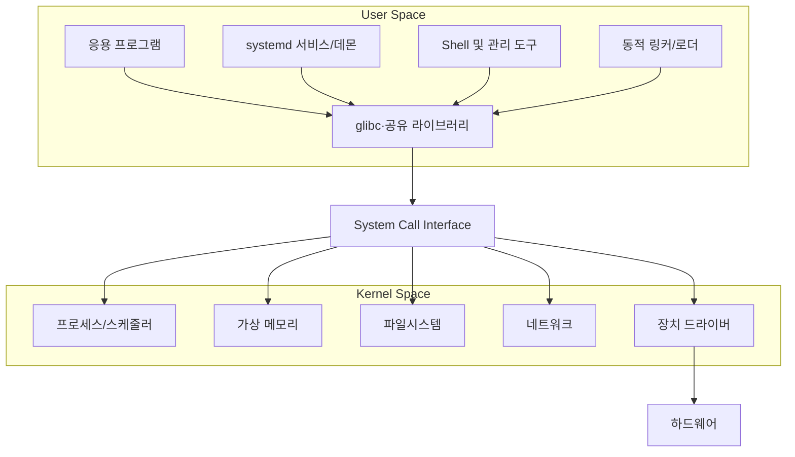

# 임베디드 Linux 사용자 영역 설정과 라이브러리 관리 보고서

| 항목 | 내용 |
|---|---|
| 과제 | 사용자 영역 설정과 라이브러리 관리 조사 및 실습 |
| 개발 호스트 | Ubuntu/Debian 계열 Linux 데스크톱 |
| 대상 시스템 | Raspberry Pi 4 또는 ARM64 임베디드 Linux |
| 개발 언어 | C |
| 호스트 컴파일러 | GCC |
| 크로스 컴파일러 | `aarch64-linux-gnu-gcc` |
| 라이브러리 형식 | 정적 라이브러리 `.a`, 공유 라이브러리 `.so` |
| 작성일 | 2026-07-18 |
| 실제 장비 검증 | Raspberry Pi 4에서 별도 수행 필요 |

> 이 문서는 사용자 영역의 개념, 설정 원칙, 라이브러리 관리 방법과 ARM64 크로스 컴파일 실습을 함께 정리한 보고서다. 실제 Raspberry Pi 4 실행 및 성능 측정은 장비에서 수행한 뒤 결과 기록표에 증빙을 추가한다.

---

## 1. 수행 목표

본 과제의 목표는 임베디드 Linux에서 사용자 영역(User Space)이 담당하는 역할을 이해하고, 응용 프로그램과 라이브러리를 안정적으로 구성·컴파일·배포하는 방법을 습득하는 것이다.

- 사용자 영역과 커널 영역의 차이 이해
- 사용자 영역 설정이 성능·안정성·보안에 미치는 영향 분석
- Root Filesystem과 표준 디렉터리 구조 이해
- 사용자, 그룹, 파일 권한과 서비스 실행 환경 설정
- 응용 프로그램과 라이브러리의 역할 이해
- 정적 링크와 동적 링크 비교
- C 정적·공유 라이브러리 직접 작성 및 컴파일
- SONAME, ABI, 심볼과 동적 로더 검색 순서 이해
- ARM64 크로스 컴파일러와 Sysroot 사용
- `pkg-config`를 이용한 의존성 관리
- Raspberry Pi 4에 실행 파일과 라이브러리 배포
- 장애 복구, 버전 고정과 재현 가능한 빌드 방법 이해

---

## 2. 사용자 영역의 기본 개념

Linux 시스템은 CPU 권한과 메모리 보호 관점에서 사용자 영역과 커널 영역으로 나뉜다.



### 2.1 사용자 영역

사용자 영역에서는 다음 요소가 실행된다.

- 제품 기능을 구현하는 응용 프로그램
- 셸, 시스템 관리 명령과 데몬
- C/C++ 런타임 및 공유 라이브러리
- GUI, 네트워크, 데이터베이스와 로그 서비스
- 장치 제어를 위한 사용자 공간 프로그램
- init 시스템과 `systemd` 서비스

사용자 프로그램은 일반적으로 하드웨어 레지스터나 커널 메모리에 직접 접근하지 않는다. 파일 열기, 메모리 매핑, 네트워크 송수신, 프로세스 생성과 장치 제어를 시스템 콜을 통해 커널에 요청한다.

### 2.2 커널 영역

커널 영역은 높은 CPU 권한에서 다음 기능을 제공한다.

- 프로세스와 스레드 스케줄링
- 가상 메모리, 페이지 캐시와 메모리 보호
- 파일시스템과 블록 장치 관리
- 네트워크 스택
- 인터럽트와 장치 드라이버
- 시스템 콜 처리

사용자 프로그램의 잘못된 메모리 접근은 보통 해당 프로세스의 `SIGSEGV`로 제한된다. 반면 커널이나 드라이버의 오류는 Kernel panic, 전체 시스템 정지 또는 데이터 손상으로 확대될 수 있다. 가능한 기능을 사용자 영역에 구현하는 것은 장애 격리와 유지보수 측면에서 유리하다.

### 2.3 응용 프로그램과 라이브러리의 역할

응용 프로그램은 센서 입력, 데이터 처리, 상태 판단, 네트워크 전송처럼 제품의 실제 기능을 수행한다. 라이브러리는 여러 프로그램이 공통으로 사용하는 기능과 인터페이스를 제공한다.

```text
sensor_app ──┐
monitor_app ─┼──→ libdevice.so ──→ glibc ──→ System Call ──→ Kernel
test_app    ─┘
```

라이브러리를 사용하면 다음 이점을 얻을 수 있다.

- 공통 코드 재사용과 중복 제거
- 하드웨어 접근부와 비즈니스 로직 분리
- API 기반 모듈화
- 프로그램 간 동작 일관성 확보
- 단위 테스트와 Mock 적용 용이
- 버그 수정과 보안 업데이트 범위 명확화
- 팀별 병렬 개발과 유지보수성 향상

---

## 3. 사용자 영역 설정의 중요성

사용자 영역 설정은 단순히 프로그램을 복사하는 작업이 아니다. RootFS 구조, 권한, 서비스 의존성, 라이브러리 버전, 자원 제한, 로그와 업데이트 정책을 함께 결정하는 시스템 설계 작업이다.

### 3.1 성능에 미치는 영향

| 요소 | 성능 영향 |
|---|---|
| 불필요한 서비스 | 부팅시간, 상주 메모리와 CPU wake-up 증가 |
| 라이브러리 구성 | 실행 파일 크기, 페이지 공유, 로드/relocation 시간 변화 |
| 최적화 옵션 | 실행 속도와 코드 크기의 trade-off 발생 |
| 로깅 정책 | 저장장치 쓰기량, I/O 지연과 flash 수명에 영향 |
| 메모리 제한 | 한 서비스의 폭주로 인한 전체 OOM 방지, 제한이 너무 작으면 반복 종료 |
| 스케줄링 우선순위 | 응답시간 개선 가능, 오설정 시 다른 서비스 starvation |
| 파일시스템 배치 | 읽기 전용/쓰기 영역 분리로 부팅 신뢰성과 write amplification 변화 |

공유 라이브러리는 여러 프로세스가 동일한 읽기 전용 코드 페이지를 공유할 가능성이 있어 전체 메모리와 저장공간을 줄일 수 있다. 그러나 relocation, symbol lookup과 페이지 사용 패턴에 따라 효과가 달라지므로 실제 대상에서 RSS/PSS와 시작 시간을 측정해야 한다.

### 3.2 안정성에 미치는 영향

| 잘못된 설정 | 발생 가능한 문제 | 적절한 설정 효과 |
|---|---|---|
| 모든 서비스를 root로 실행 | 침해 또는 버그가 시스템 전체 권한 획득 | 전용 사용자로 피해 범위 제한 |
| 잘못된 파일 권한 | 설정 유출, 데이터 변조 또는 실행 실패 | 최소 권한과 소유권 명확화 |
| 무제한 메모리 사용 | OOM Killer와 핵심 서비스 종료 | 서비스별 자원 상한 적용 |
| 서비스 순서 오류 | 장치·네트워크 준비 전에 실행되어 실패 | 명시적 의존성과 재시작 정책 |
| 전역 `LD_LIBRARY_PATH` | 예상하지 못한 `.so`가 먼저 로드됨 | 표준 경로, RUNPATH 또는 전용 실행 환경 |
| ABI가 다른 라이브러리 교체 | 실행 실패 또는 런타임 오동작 | SONAME과 호환성 정책 적용 |
| 무제한 로그 | RootFS 용량 고갈 | 순환 로그와 용량 제한 |
| 개발 파일 포함 | 이미지 크기와 공격 표면 증가 | 실행에 필요한 파일만 배포 |

### 3.3 보안에 미치는 영향

- 전용 사용자와 그룹으로 최소 권한 원칙 적용
- 쓰기 가능한 디렉터리를 `/var/lib/<app>`와 `/run/<app>` 등으로 제한
- 실행 파일과 라이브러리를 일반 사용자가 변경하지 못하도록 소유권 설정
- 환경변수를 통한 라이브러리 주입 방지
- 불필요한 shell, compiler, header, debug 도구 제거
- 실행 파일과 업데이트 패키지의 해시 또는 서명 검증
- 취약한 공유 라이브러리의 버전 추적과 보안 패치

---

## 4. 사용자 영역 기본 설정 절차


### 4.1 Root Filesystem과 디렉터리 설계

[Filesystem Hierarchy Standard 3.0](https://refspecs.linuxfoundation.org/FHS_3.0/fhs-3.0.html)은 시스템 통합과 패키지 관리를 위한 표준 디렉터리 역할을 정의한다.

| 경로 | 권장 용도 |
|---|---|
| `/usr/bin` | 배포판 또는 시스템이 관리하는 일반 실행 파일 |
| `/usr/lib` | 시스템 공유 라이브러리와 관련 데이터 |
| `/usr/local/bin` | 패키지 관리 외부에서 로컬 설치한 실행 파일 |
| `/usr/local/lib` | 로컬 설치 공유 라이브러리 |
| `/opt/<vendor>/<app>` | 제품/공급자 단위로 독립 배치한 소프트웨어 |
| `/etc/<app>` | 시스템별 정적 설정 파일 |
| `/var/lib/<app>` | 재부팅 후에도 유지되는 애플리케이션 상태 |
| `/var/log/<app>` | 로그 파일(파일 로그를 사용할 경우) |
| `/run/<app>` | PID, socket 등 부팅 후 생성되는 임시 런타임 데이터 |
| `/tmp` | 재생성 가능한 단기 임시 파일 |

제품 전용 배치 예시는 다음과 같다.

```text
/opt/mydevice/
├── bin/
│   └── sensor_app
└── lib/
    ├── libcalc.so.1
    └── libcalc.so.1.0.0

/etc/mydevice/
└── sensor.conf

/var/lib/mydevice/
└── state.db

/run/mydevice/
└── sensor.sock
```

### 4.2 전용 사용자와 그룹

네트워크나 외부 입력을 처리하는 프로그램을 root로 실행하지 않고 전용 시스템 사용자로 실행한다.

```bash
sudo groupadd --system sensor
sudo useradd \
  --system \
  --gid sensor \
  --home-dir /var/lib/mydevice \
  --shell /usr/sbin/nologin \
  sensor-app

sudo install -d -m 0750 -o sensor-app -g sensor /var/lib/mydevice
sudo install -d -m 0750 -o sensor-app -g sensor /run/mydevice
sudo install -d -m 0750 -o root -g sensor /etc/mydevice
```

하드웨어 장치가 특정 그룹을 통해 접근되도록 설정된 경우 필요한 그룹만 보조 그룹으로 추가한다. `dialout`, `gpio`, `i2c` 그룹은 배포판 설정을 확인한 뒤 최소한으로 사용한다.

### 4.3 파일 권한

```bash
sudo chown root:root /opt/mydevice/bin/sensor_app
sudo chmod 0755 /opt/mydevice/bin/sensor_app

sudo chown -R root:root /opt/mydevice/lib
sudo chmod 0755 /opt/mydevice/lib/libcalc.so.1.0.0

sudo chown root:sensor /etc/mydevice/sensor.conf
sudo chmod 0640 /etc/mydevice/sensor.conf
```

실행 파일과 라이브러리는 서비스 사용자가 읽고 실행할 수 있지만 수정하지 못하게 한다. 변경 데이터 디렉터리만 서비스 사용자에게 쓰기 권한을 준다.

### 4.4 환경변수

```bash
echo "$PATH"
echo "$LD_LIBRARY_PATH"
```

개발 중 임시 시험에는 다음을 사용할 수 있다.

```bash
export PATH=/opt/mydevice/bin:$PATH
export LD_LIBRARY_PATH=/opt/mydevice/lib
/opt/mydevice/bin/sensor_app
```

그러나 전역 `LD_LIBRARY_PATH`는 다른 프로그램의 라이브러리 선택까지 변경하고, 잘못된 또는 악의적인 라이브러리를 먼저 로드할 위험이 있다. 운영 환경에서는 다음 순서로 검토한다.

1. 표준 라이브러리 경로 사용
2. 제품 전용 경로와 `ldconfig` 사용
3. 이동 가능한 번들이 필요하면 제한된 `$ORIGIN` RUNPATH 사용
4. systemd unit의 해당 서비스에만 `Environment=` 적용
5. 전역 `LD_LIBRARY_PATH`는 가능한 한 사용하지 않음

### 4.5 systemd 서비스

`/etc/systemd/system/sensor-app.service` 예시:

```ini
[Unit]
Description=Embedded Sensor Application
After=local-fs.target network-online.target
Wants=network-online.target

[Service]
Type=simple
User=sensor-app
Group=sensor
ExecStart=/opt/mydevice/bin/sensor_app --config /etc/mydevice/sensor.conf
WorkingDirectory=/var/lib/mydevice
Restart=on-failure
RestartSec=2s

NoNewPrivileges=true
PrivateTmp=true
ProtectSystem=strict
ProtectHome=true
ReadWritePaths=/var/lib/mydevice /run/mydevice
MemoryHigh=128M
MemoryMax=192M
TasksMax=64

[Install]
WantedBy=multi-user.target
```

적용 및 확인:

```bash
sudo systemctl daemon-reload
sudo systemctl enable --now sensor-app.service
systemctl status sensor-app.service
journalctl -u sensor-app.service -b
systemctl show sensor-app.service -p User -p MemoryCurrent -p MemoryMax
```

자원 제한값은 예시이며 실제 사용량을 측정한 후 여유를 두고 결정한다. 너무 낮은 `MemoryMax`는 정상적인 순간 부하에서도 서비스를 종료시킬 수 있다.

---

## 5. 라이브러리 관리의 중요성

라이브러리 관리는 `.so` 파일 하나를 복사하는 일이 아니다. 다음 요소를 하나의 배포 단위로 관리해야 한다.

- 공개 API 헤더 파일
- 정적 `.a` 또는 공유 `.so` 파일
- CPU 아키텍처와 ABI
- SONAME 및 파일 버전
- 의존 라이브러리 목록
- 컴파일 옵션과 C 런타임 종류(glibc, musl, uClibc-ng)
- 검색 경로와 동적 로더
- `pkg-config` 메타데이터
- 디버그 심볼과 stripped runtime 파일
- 라이선스, 저작권 고지와 소스 제공 의무
- 보안 패치와 SBOM(Software Bill of Materials)

관리 오류는 다음과 같은 형태로 나타난다.

```text
fatal error: calc.h: No such file or directory
undefined reference to `add_int`
libcalc.so.1: cannot open shared object file
version `GLIBC_2.xx` not found
Exec format error
```

라이브러리 버전과 의존성을 명확하게 관리하면 코드 재사용, 이미지 크기 최적화, 보안 업데이트, 재현 가능한 빌드와 롤백이 쉬워진다.

---

## 6. 정적 링크와 동적 링크

### 6.1 비교

| 구분 | 정적 링크 | 동적 링크 |
|---|---|---|
| 라이브러리 파일 | `libname.a` | `libname.so`, `libname.so.N` |
| 링크 시점 | 빌드 시 코드가 실행 파일에 포함 | 링크 시 의존성 기록, 실행 시 로더가 `.so` 적재 |
| 실행 파일 크기 | 일반적으로 큼 | 일반적으로 작음 |
| 런타임 파일 의존성 | 적음 | 정확한 동적 로더와 `.so` 필요 |
| 여러 프로세스 코드 공유 | 실행 파일마다 포함 | 읽기 전용 코드 페이지 공유 가능 |
| 라이브러리 업데이트 | 응용 프로그램 재링크 필요 | ABI 호환 시 `.so` 교체 가능 |
| 배포 난이도 | 단순할 수 있음 | SONAME, 경로와 버전 관리 필요 |
| 플러그인/dlopen | 제한적 | 적합 |
| 보안 패치 | 모든 실행 파일 재빌드 | 공유 라이브러리와 호환 앱 검증 후 교체 가능 |

[GNU GCC Link Options](https://gcc.gnu.org/onlinedocs/gcc/Link-Options.html)에 따르면 `-l<name>`은 `lib<name>.a` 또는 `lib<name>.so`를 검색하며, 둘 다 있으면 일반적으로 공유 라이브러리를 우선하고 `-static` 사용 시 정적 라이브러리를 선택한다. 라이브러리는 명령행에서 이를 사용하는 객체 파일 뒤에 두는 것이 중요하다.

### 6.2 정적 링크 장단점

장점:

- 특정 제품에서 필요한 라이브러리를 실행 파일에 포함하여 배포 단순화
- 대상의 동적 라이브러리 경로 문제 감소
- 작은 단일 목적 시스템이나 rescue binary에 유용

단점:

- 여러 실행 파일이 같은 코드를 중복 포함
- 라이브러리 보안 패치 시 모든 실행 파일을 재빌드·재배포
- 완전 정적 glibc 프로그램은 NSS, DNS, locale과 동적 모듈 기능을 추가로 검토해야 함
- 라이브러리 라이선스의 정적 링크 조건 확인 필요

### 6.3 동적 링크 장단점

장점:

- 실행 파일과 전체 이미지 크기를 줄일 가능성
- 프로세스 간 코드 페이지 공유
- ABI 호환 범위에서 라이브러리 단독 업데이트 가능
- 플러그인과 런타임 선택 기능 구현 가능

단점:

- 동적 로더, SONAME, 심볼 버전과 검색 경로 관리 필요
- 잘못된 버전 교체 시 다수 프로그램이 동시에 실패
- 시작 시 라이브러리 탐색과 relocation 비용 발생
- 대상 RootFS와 개발 Sysroot가 다르면 실행 오류 발생

선택 기준은 “임베디드이므로 무조건 정적 링크” 또는 “공유 라이브러리가 항상 작다”가 아니다. 프로그램 수, 업데이트 정책, RAM/flash 용량, C 라이브러리, 보안 패치와 라이선스를 함께 판단해야 한다.

---

## 7. 동적 링커/로더와 검색 경로

[Linux `ld.so(8)`](https://man7.org/linux/man-pages/man8/ld.so.8.html)에 따르면 동적으로 링크된 ELF 프로그램은 `.interp` 영역에 기록된 동적 로더가 필요한 공유 객체를 찾아 적재하고 실행 준비를 수행한다.

주요 확인 명령:

```bash
readelf -l ./app_shared | grep 'interpreter'
readelf -d ./app_shared | grep -E 'NEEDED|SONAME|RPATH|RUNPATH'
```

일반적인 검색 요소는 다음과 같다.

- 의존 항목에 `/`가 포함된 직접 경로
- ELF의 `DT_RPATH` 또는 `DT_RUNPATH`
- `LD_LIBRARY_PATH` 환경변수(secure-execution에서는 제한됨)
- `/etc/ld.so.cache`
- `/lib`, `/usr/lib`와 아키텍처별 trusted directory

### 7.1 `ldconfig`

[Linux `ldconfig(8)`](https://man7.org/linux/man-pages/man8/ldconfig.8.html)는 `/etc/ld.so.conf`, trusted directory와 명령행 경로를 검사하여 필요한 심볼릭 링크와 `/etc/ld.so.cache`를 생성한다.

```bash
sudo ldconfig
ldconfig -p | grep calc
```

권장 파일 관계:

```text
libcalc.so          → libcalc.so.1
libcalc.so.1        → libcalc.so.1.0.0
libcalc.so.1.0.0    실제 공유 라이브러리
```

- `libcalc.so`: 개발 시 `-lcalc`가 찾는 linker name
- `libcalc.so.1`: 런타임에 실행 파일의 `DT_NEEDED`가 요구하는 SONAME
- `libcalc.so.1.0.0`: 실제 구현 파일

---

## 8. C 라이브러리 작성 실습

### 8.1 디렉터리 구조

```text
library_example/
├── include/
│   └── calc.h
├── src/
│   └── calc.c
├── app.c
└── build/
```

### 8.2 공개 헤더 `include/calc.h`

```c
#ifndef CALC_H
#define CALC_H

#ifdef __cplusplus
extern "C" {
#endif

int add_int(int a, int b);
int subtract_int(int a, int b);

#ifdef __cplusplus
}
#endif

#endif
```

### 8.3 구현 `src/calc.c`

```c
#include "calc.h"

int add_int(int a, int b)
{
    return a + b;
}

int subtract_int(int a, int b)
{
    return a - b;
}
```

### 8.4 응용 프로그램 `app.c`

```c
#include <stdio.h>

#include "calc.h"

int main(void)
{
    printf("add: %d\n", add_int(10, 3));
    printf("subtract: %d\n", subtract_int(10, 3));
    return 0;
}
```

### 8.5 공통 준비

```bash
mkdir -p build/static build/shared
```

---

## 9. 정적 라이브러리 컴파일

객체 파일 생성:

```bash
gcc -std=c11 -Wall -Wextra -Werror -O2 \
  -Iinclude \
  -c src/calc.c \
  -o build/static/calc.o
```

정적 라이브러리 생성:

```bash
ar rcs build/static/libcalc.a build/static/calc.o
```

응용 프로그램 링크:

```bash
gcc -std=c11 -Wall -Wextra -Werror -O2 \
  -Iinclude \
  app.c \
  -Lbuild/static -lcalc \
  -o build/app_static
```

실행 및 확인:

```bash
./build/app_static
file ./build/app_static
readelf -d ./build/app_static
```

예상 출력:

```text
add: 13
subtract: 7
```

여기서 `libcalc.a`는 정적으로 포함되지만 glibc 등 시스템 라이브러리는 기본적으로 동적으로 링크될 수 있다. 모든 의존성을 정적으로 링크하려면 별도로 `-static`을 지정하고 정적 버전 라이브러리가 준비되어 있어야 한다.

---

## 10. 공유 라이브러리 컴파일

공유 라이브러리에 사용할 PIC(Position Independent Code) 객체 생성:

```bash
gcc -std=c11 -Wall -Wextra -Werror -O2 -fPIC \
  -Iinclude \
  -c src/calc.c \
  -o build/shared/calc.pic.o
```

SONAME을 지정하여 실제 공유 라이브러리 생성:

```bash
gcc -shared \
  -Wl,-soname,libcalc.so.1 \
  -o build/shared/libcalc.so.1.0.0 \
  build/shared/calc.pic.o
```

심볼릭 링크 생성:

```bash
ln -sfn libcalc.so.1.0.0 build/shared/libcalc.so.1
ln -sfn libcalc.so.1 build/shared/libcalc.so
```

응용 프로그램 링크:

```bash
gcc -std=c11 -Wall -Wextra -Werror -O2 \
  -Iinclude \
  app.c \
  -Lbuild/shared -lcalc \
  -Wl,-rpath,'$ORIGIN/shared' \
  -o build/app_shared
```

실행 및 의존성 확인:

```bash
./build/app_shared
file ./build/app_shared
ldd ./build/app_shared
readelf -d ./build/app_shared | grep -E 'NEEDED|SONAME|RPATH|RUNPATH'
readelf -d ./build/shared/libcalc.so.1.0.0 | grep SONAME
nm -D --defined-only ./build/shared/libcalc.so.1.0.0
```

`$ORIGIN`은 실행 파일 자신이 있는 디렉터리를 기준으로 해석된다. 예제에서는 `build/app_shared`가 `build/shared`의 라이브러리를 찾는다. 운영 제품에서 RUNPATH를 사용할 때는 일반 사용자가 해당 디렉터리의 라이브러리를 바꿀 수 없도록 권한을 설정해야 한다.

---

## 11. 공유 라이브러리 설치 방법

### 11.1 시스템/로컬 경로에 설치

```bash
sudo install -D -m 0644 include/calc.h \
  /usr/local/include/calc.h

sudo install -D -m 0755 build/shared/libcalc.so.1.0.0 \
  /usr/local/lib/libcalc.so.1.0.0

sudo ln -sfn libcalc.so.1.0.0 /usr/local/lib/libcalc.so.1
sudo ln -sfn libcalc.so.1 /usr/local/lib/libcalc.so
sudo ldconfig
```

확인:

```bash
ldconfig -p | grep libcalc
```

### 11.2 제품 전용 경로에 설치

```bash
sudo install -D -m 0755 build/app_shared \
  /opt/mydevice/bin/app_shared

sudo install -D -m 0755 build/shared/libcalc.so.1.0.0 \
  /opt/mydevice/lib/libcalc.so.1.0.0

sudo ln -sfn libcalc.so.1.0.0 /opt/mydevice/lib/libcalc.so.1
```

제품 전용 배포에서는 개발용 `libcalc.so` 링크와 헤더 파일을 대상 RootFS에서 제외할 수 있다. 런타임에는 실행 파일이 요구하는 SONAME 링크와 실제 파일이 필요하다.

---

## 12. SONAME, API와 ABI 관리

### 12.1 개념

- **API(Application Programming Interface)**: 헤더에 보이는 함수, 형식, 상수와 호출 규칙
- **ABI(Application Binary Interface)**: 이미 빌드된 프로그램과 라이브러리 사이의 바이너리 수준 규칙
- **SONAME**: 실행 파일이 런타임 의존성으로 기록하는 공유 라이브러리 ABI 주 버전

### 12.2 버전 정책 예시

```text
libcalc.so       개발 링크 이름
libcalc.so.1     SONAME/ABI 주 버전
libcalc.so.1.2.0 실제 구현 파일
```

| 변경 | 일반적인 처리 |
|---|---|
| 내부 구현 수정, API 동일 | SONAME 유지 가능 |
| 기존 ABI와 호환되는 함수 추가 | SONAME 유지 가능 |
| 함수 인자/반환형 변경 | ABI 변경, SONAME 주 버전 증가 검토 |
| 공개 구조체 크기/필드 변경 | ABI 변경 가능, SONAME 증가 검토 |
| 기존 함수 또는 심볼 제거 | ABI 비호환, SONAME 증가 필요 |

같은 함수 이름이 남아 있어도 구조체 layout, 정렬, enum 크기, 컴파일러 옵션과 C++ name mangling 변화로 ABI가 깨질 수 있다. 배포 전에 `readelf`, `nm`, ABI 검사 도구와 실제 이전 버전 응용 프로그램로 호환성을 시험한다.

---

## 13. `pkg-config`를 이용한 사용법 배포

라이브러리 사용자가 `-I`, `-L`, `-l` 옵션과 의존 버전을 직접 기억하지 않도록 `.pc` 메타데이터를 제공할 수 있다. [pkg-config guide](https://people.freedesktop.org/~dbn/pkg-config-guide.html)는 `Cflags`, `Libs`, `Requires` 및 버전 확인 방법을 설명한다.

`libcalc.pc` 예시:

```text
prefix=/usr/local
exec_prefix=${prefix}
includedir=${prefix}/include
libdir=${exec_prefix}/lib

Name: libcalc
Description: Integer calculation example library
Version: 1.0.0
Cflags: -I${includedir}
Libs: -L${libdir} -lcalc
```

설치:

```bash
sudo install -D -m 0644 libcalc.pc \
  /usr/local/lib/pkgconfig/libcalc.pc
```

사용:

```bash
pkg-config --modversion libcalc
pkg-config --cflags --libs libcalc

gcc -std=c11 -Wall -Wextra -Werror \
  app.c \
  $(pkg-config --cflags --libs libcalc) \
  -o app_pkgconfig
```

Makefile에서는 shell command substitution 대신 다음처럼 사용하는 것이 명확하다.

```make
CC      := gcc
CFLAGS  := -std=c11 -Wall -Wextra -Werror -O2
CFLAGS  += $(shell pkg-config --cflags libcalc)
LDLIBS  := $(shell pkg-config --libs libcalc)

app: app.c
	$(CC) $(CFLAGS) $< $(LDLIBS) -o $@
```

---

## 14. ARM64 크로스 컴파일

### 14.1 크로스 컴파일 개념

```text
Host: x86_64 Linux
  └─ aarch64-linux-gnu-gcc 실행
       ├─ ARM64용 헤더와 라이브러리(Sysroot) 참조
       └─ ARM64 ELF 실행 파일/공유 라이브러리 생성

Target: Raspberry Pi 4 ARM64 Linux
  └─ 생성된 ARM64 ELF 실행
```

도구 설치:

```bash
sudo apt update
sudo apt install -y \
  gcc-aarch64-linux-gnu \
  binutils-aarch64-linux-gnu \
  pkg-config
```

### 14.2 ARM64 공유 라이브러리 빌드

```bash
mkdir -p build/arm64/lib

aarch64-linux-gnu-gcc \
  -std=c11 -Wall -Wextra -Werror -O2 -fPIC \
  -Iinclude \
  -c src/calc.c \
  -o build/arm64/calc.pic.o

aarch64-linux-gnu-gcc \
  -shared \
  -Wl,-soname,libcalc.so.1 \
  -o build/arm64/lib/libcalc.so.1.0.0 \
  build/arm64/calc.pic.o

ln -sfn libcalc.so.1.0.0 build/arm64/lib/libcalc.so.1
ln -sfn libcalc.so.1 build/arm64/lib/libcalc.so
```

### 14.3 ARM64 응용 프로그램 빌드

```bash
aarch64-linux-gnu-gcc \
  -std=c11 -Wall -Wextra -Werror -O2 \
  -Iinclude \
  app.c \
  -Lbuild/arm64/lib -lcalc \
  -Wl,-rpath,'$ORIGIN/lib' \
  -o build/arm64/app_arm64
```

확인:

```bash
file build/arm64/app_arm64
file build/arm64/lib/libcalc.so.1.0.0
aarch64-linux-gnu-readelf -h build/arm64/app_arm64
aarch64-linux-gnu-readelf -d build/arm64/app_arm64
```

예상 핵심 출력:

```text
ELF 64-bit LSB pie executable, ARM aarch64
```

x86_64 호스트에서는 ARM64 프로그램을 직접 실행할 수 없다. 실제 Raspberry Pi 4 또는 올바른 ARM64 userspace를 제공하는 QEMU 환경에서 실행해야 한다.

---

## 15. Sysroot 관리

[GNU GCC Directory Options](https://gcc.gnu.org/onlinedocs/gcc/Directory-Options.html)에 따르면 `--sysroot=<dir>`은 헤더와 라이브러리 검색의 논리적 루트를 지정한다. 컴파일러가 원래 `/usr/include`, `/usr/lib`를 찾는 대신 `<dir>/usr/include`, `<dir>/usr/lib`를 사용하게 한다.

```text
rpi-sysroot/
├── lib/
├── usr/
│   ├── include/
│   └── lib/
└── etc/
```

### 15.1 대상에서 Sysroot 동기화 예시

```bash
export TARGET=pi@<TARGET_IP>
export SYSROOT=$HOME/sysroots/rpi4

mkdir -p "$SYSROOT/usr" "$SYSROOT/lib"

rsync -a --delete "$TARGET":/lib/ "$SYSROOT/lib/"
rsync -a --delete "$TARGET":/usr/include/ "$SYSROOT/usr/include/"
rsync -a --delete "$TARGET":/usr/lib/ "$SYSROOT/usr/lib/"
```

절대 경로 심볼릭 링크가 Sysroot 밖의 호스트 파일을 가리키지 않는지 확인해야 한다. 가능하면 Raspberry Pi OS 또는 사용 중인 빌드 시스템이 제공하는 공식 SDK/Sysroot를 사용한다.

### 15.2 Sysroot를 사용한 컴파일

```bash
export SYSROOT=$HOME/sysroots/rpi4

aarch64-linux-gnu-gcc \
  --sysroot="$SYSROOT" \
  -std=c11 -Wall -Wextra -Werror -O2 \
  app.c \
  -o app_arm64
```

`--sysroot`를 사용하는데 다시 호스트의 `/usr/include`나 `/usr/lib`를 직접 `-I`, `-L`로 추가하면 x86 헤더와 라이브러리가 섞일 수 있다.

### 15.3 크로스 `pkg-config`

```bash
export SYSROOT=$HOME/sysroots/rpi4
export PKG_CONFIG_SYSROOT_DIR="$SYSROOT"
export PKG_CONFIG_LIBDIR="$SYSROOT/usr/lib/aarch64-linux-gnu/pkgconfig:$SYSROOT/usr/lib/pkgconfig:$SYSROOT/usr/share/pkgconfig"
unset PKG_CONFIG_PATH

pkg-config --cflags --libs <target-library>
```

호스트의 `.pc` 파일이 검색되면 호스트 경로와 라이브러리가 빌드에 섞일 수 있으므로 `PKG_CONFIG_LIBDIR`로 대상 전용 검색 경로를 제한한다.

### 15.4 Buildroot와 Yocto

[Buildroot User Manual](https://buildroot.org/downloads/manual/manual.html)은 다음 디렉터리를 구분한다.

- `host/`: 크로스 툴체인과 target toolchain sysroot
- `staging/`: target sysroot를 가리키는 호환용 링크
- `target/`: 대상 RootFS에 들어갈 런타임 파일 중심의 트리
- `images/`: 실제 장치에 배포할 파일시스템 이미지

Buildroot의 `target/`를 그대로 장치에 복사하는 대신 `images/`에서 생성한 이미지나 tarball을 사용해야 실제 권한과 장치 파일 구성이 올바르게 반영된다. `make sdk`로 애플리케이션 개발용 툴체인과 Sysroot를 내보낼 수 있다.

Yocto SDK도 cross-toolchain과 대상 이미지의 메타데이터에 맞는 target sysroot를 함께 제공한다. SDK의 `environment-setup-*` 스크립트를 source하여 `CC`, `CXX`, `PKG_CONFIG_SYSROOT_DIR`, `SDKTARGETSYSROOT` 등의 환경을 사용한다. [Yocto Project SDK Manual](https://docs.yoctoproject.org/current/sdk-manual/)을 참고한다.

---

## 16. Raspberry Pi 4 배포

### 16.1 배포 구조

```text
deploy/
├── app_arm64
└── lib/
    ├── libcalc.so.1 -> libcalc.so.1.0.0
    └── libcalc.so.1.0.0
```

호스트에서 구성:

```bash
mkdir -p deploy/lib
cp build/arm64/app_arm64 deploy/
cp -a build/arm64/lib/libcalc.so.1 \
      build/arm64/lib/libcalc.so.1.0.0 \
      deploy/lib/
```

대상 디렉터리를 먼저 준비한다.

```bash
ssh pi@<TARGET_IP> 'sudo install -d -m 0755 /opt/mydevice/bin /opt/mydevice/lib'
```

파일 전송:

```bash
scp deploy/app_arm64 pi@<TARGET_IP>:/tmp/
scp -r deploy/lib pi@<TARGET_IP>:/tmp/mydevice-lib

ssh pi@<TARGET_IP> '\
  sudo install -m 0755 /tmp/app_arm64 /opt/mydevice/bin/app_arm64 && \
  sudo cp -a /tmp/mydevice-lib/. /opt/mydevice/lib/'
```

대상에서 확인:

```bash
file /opt/mydevice/bin/app_arm64
readelf -d /opt/mydevice/bin/app_arm64 | grep -E 'NEEDED|RUNPATH'
ldd /opt/mydevice/bin/app_arm64
/opt/mydevice/bin/app_arm64
```

예상 출력:

```text
add: 13
subtract: 7
```

### 16.2 배포 전 체크

```bash
sha256sum deploy/app_arm64 deploy/lib/libcalc.so.1.0.0
```

호스트와 대상에서 SHA-256을 비교하고, 실행 파일이 요구하는 동적 로더와 `GLIBC_*` symbol version이 대상에 존재하는지 확인한다.

```bash
readelf -l deploy/app_arm64 | grep interpreter
readelf --version-info deploy/app_arm64 | grep GLIBC
```

대상보다 새로운 glibc로 빌드한 프로그램은 `GLIBC_2.xx not found` 오류가 발생할 수 있다. 대상 이미지와 일치하는 SDK/Sysroot로 빌드하는 것이 핵심이다.

---

## 17. 라이브러리와 실행 파일 진단 도구

| 명령 | 용도 |
|---|---|
| `file` | ELF 아키텍처, 32/64비트, 동적 링크 여부 확인 |
| `readelf -h` | ELF 헤더와 Machine 확인 |
| `readelf -l` | 프로그램 헤더와 interpreter 확인 |
| `readelf -d` | `NEEDED`, SONAME, RPATH/RUNPATH 확인 |
| `readelf --version-info` | 요구하는 symbol version 확인 |
| `nm -D` | 동적 심볼 확인 |
| `objdump -p` | ELF 의존성과 헤더 확인 |
| `ldd` | 대상 환경에서 실제 해석된 공유 라이브러리 확인 |
| `ldconfig -p` | 동적 링커 캐시 목록 확인 |
| `strace` | 라이브러리 파일 탐색과 시스템 콜 확인 |
| `size` | text/data/bss 크기 확인 |
| `strip` | 런타임 바이너리의 불필요한 심볼 제거 |

> 신뢰할 수 없는 실행 파일에 `ldd`를 사용하지 않는다. 분석 대상이 안전하지 않다면 우선 `readelf -d`와 `objdump -p`로 정적 확인을 수행한다.

예시:

```bash
readelf -d ./app_shared | grep -E 'NEEDED|RPATH|RUNPATH'
nm -D ./libcalc.so.1.0.0 | grep add_int
strace -f -e trace=openat ./app_shared
size ./app_static ./app_shared
```

---

## 18. 자주 발생하는 오류와 해결

### 18.1 헤더 검색 오류

```text
fatal error: calc.h: No such file or directory
```

확인:

```bash
gcc -Iinclude ...
pkg-config --cflags libcalc
```

### 18.2 링크 오류

```text
undefined reference to `add_int`
```

확인:

```bash
gcc app.c -Lbuild/shared -lcalc -o app
nm -D build/shared/libcalc.so.1.0.0 | grep add_int
```

`-lcalc`는 일반적으로 이를 사용하는 `app.c` 또는 객체 파일 뒤에 둔다.

### 18.3 런타임 검색 오류

```text
libcalc.so.1: cannot open shared object file: No such file or directory
```

확인 항목:

- 실제 파일과 `libcalc.so.1` 링크 존재 여부
- `readelf -d`의 SONAME과 NEEDED
- RUNPATH/RPATH
- `/etc/ld.so.conf` 및 `/etc/ld.so.cache`
- 아키텍처별 라이브러리 디렉터리

### 18.4 실행 형식 오류

```text
Exec format error
```

원인:

- x86_64 파일을 ARM64에서 실행
- ARM64 파일을 x86_64에서 직접 실행
- 32비트와 64비트 불일치
- 잘못된 ELF interpreter

```bash
file app_arm64
readelf -h app_arm64 | grep Machine
readelf -l app_arm64 | grep interpreter
```

### 18.5 glibc 버전 오류

```text
version `GLIBC_2.xx' not found
```

대상보다 새로운 glibc를 사용하는 Sysroot에서 빌드한 경우 발생할 수 있다. 대상과 같은 또는 호환되는 SDK/Sysroot로 다시 빌드한다.

### 18.6 서비스 반복 재시작

```bash
systemctl status sensor-app.service
journalctl -u sensor-app.service -b -n 100
systemctl show sensor-app.service -p Result -p ExecMainStatus -p NRestarts
```

실행 경로, 권한, 환경변수, WorkingDirectory, 장치 준비 순서와 `MemoryMax` 초과 여부를 확인한다.

---

## 19. 성능·안정성 평가 방법

정적/동적 링크와 사용자 영역 설정의 효과는 추측하지 않고 같은 조건에서 측정한다.

### 19.1 측정 항목

| 항목 | 측정 도구/방법 |
|---|---|
| 실행 파일과 라이브러리 크기 | `du -b`, `size`, 전체 배포 디렉터리 크기 |
| 시작 시간 | `/usr/bin/time`, systemd `systemd-analyze` |
| RSS/PSS | `/proc/<pid>/status`, `/proc/<pid>/smaps_rollup`, `smem` |
| CPU 사용률 | `pidstat`, `top`, `perf stat` |
| 페이지 fault | `/usr/bin/time -v`, `perf stat` |
| 부팅 영향 | `systemd-analyze blame`, bootchart |
| 로그 쓰기량 | `journalctl --disk-usage`, 블록 I/O 통계 |
| 장애 복구 | 프로세스 강제 종료 후 재시작 시간과 상태 일관성 |

### 19.2 정적/동적 비교 예시

```bash
size build/app_static build/app_shared
du -b build/app_static build/app_shared build/shared/libcalc.so.1.0.0

/usr/bin/time -v ./build/app_static
/usr/bin/time -v ./build/app_shared
```

공유 라이브러리 메모리 절감은 여러 프로세스가 동시에 해당 라이브러리의 같은 페이지를 사용할 때 더 의미가 있다. 한 개의 작은 프로세스만 실행하면 동적 로딩 오버헤드가 상대적으로 커 보일 수 있다.

---

## 20. 임베디드 시스템 배포 원칙

### 20.1 개발 파일과 런타임 파일 분리

| 개발/SDK에 포함 | Target RootFS에 포함 |
|---|---|
| 헤더 `.h` | 실행 파일 |
| `libname.so` linker link | SONAME link `libname.so.N` |
| 정적 라이브러리 `.a` | 실제 공유 라이브러리 `.so.N.x.y` |
| `.pc` 파일 | 런타임 설정 |
| 디버그 심볼 | 필요한 인증서와 데이터 |
| 컴파일러와 빌드 도구 | 최소 실행 의존성 |

Buildroot는 target filesystem을 마무리할 때 헤더, 정적 라이브러리와 문서를 제거하고 실행에 필요한 파일 중심으로 구성한다. 디버그 심볼은 별도 artifact 서버에 보관하고 대상에는 stripped binary를 배포할 수 있다.

### 20.2 업데이트와 롤백

- 실행 파일과 라이브러리를 하나의 버전 단위로 패키징
- 배포 전 SHA-256 또는 서명 검증
- 이전 버전 디렉터리를 보존하고 symlink로 활성 버전 전환
- ABI가 바뀌면 응용 프로그램과 라이브러리를 함께 업데이트
- 전원 차단에도 손상되지 않는 원자적 교체 방식 사용
- 업데이트 실패 시 Watchdog 또는 health check로 롤백

예시:

```text
/opt/mydevice/releases/1.0.0/
/opt/mydevice/releases/1.1.0/
/opt/mydevice/current -> releases/1.1.0
```

### 20.3 재현 가능한 빌드 기록

- 소스 Git commit/tag
- 컴파일러와 binutils 버전
- Target tuple과 CPU 옵션
- Sysroot/SDK 버전과 이미지 commit
- C library 종류와 버전
- Build flags 및 feature flags
- 모든 직접·간접 라이브러리 버전
- 산출물 SHA-256
- 라이선스와 SBOM

---

## 21. 사용자 영역 설정 체크리스트

| 확인 항목 | 확인 방법 |
|---|---|
| 전용 사용자로 실행 | `ps -o user,group,pid,cmd -C sensor_app` |
| 실행 파일 변경 권한 제한 | `stat /opt/mydevice/bin/sensor_app` |
| 설정 파일 읽기 권한 | `namei -l /etc/mydevice/sensor.conf` |
| 쓰기 경로 제한 | 서비스 사용자로 허용/거부 경로 시험 |
| 라이브러리 해석 성공 | `ldd`, `readelf -d` |
| 아키텍처 일치 | `file`, `readelf -h` |
| ABI/SONAME 일치 | `readelf -d`, `nm -D` |
| Sysroot 일치 | compiler `--print-sysroot`, SDK manifest |
| 서비스 자동 시작 | 재부팅 후 `systemctl status` |
| 자원 제한 적정 | 실제 workload에서 MemoryCurrent/CPU 측정 |
| 로그 용량 제한 | journald 또는 logrotate 정책 확인 |
| 복구 가능 | 이전 버전 롤백 시험 |

---

## 22. 실습 결과 기록 양식

실제 수행 전 항목을 완료로 표시하지 않는다.

| 확인 항목 | 상태 | 증빙 |
|---|---|---|
| 호스트 정적 라이브러리 생성 | 미수행 | `ar t`, 실행 결과 첨부 |
| 호스트 공유 라이브러리 생성 | 미수행 | `readelf -d`, symlink 목록 첨부 |
| SONAME 확인 | 미수행 | `readelf -d libcalc.so...` 출력 |
| 정적/동적 실행 파일 크기 비교 | 미수행 | `size`, `du` 출력 |
| `pkg-config` 사용 | 미수행 | `--cflags --libs` 출력 |
| ARM64 크로스 컴파일 | 미수행 | `file`, ELF Machine 출력 |
| Sysroot 기반 빌드 | 미수행 | Sysroot 및 compiler 정보 |
| Raspberry Pi 4 전송 | 미수행 | 대상 파일 목록과 SHA-256 |
| 대상 `ldd` 의존성 확인 | 미수행 | `not found` 없는 출력 |
| Raspberry Pi 4 실행 | 미수행 | 프로그램 실행 로그 |
| systemd 전용 사용자 실행 | 미수행 | `systemctl status`, `ps` 출력 |
| 재부팅 후 자동 시작 | 미수행 | 부팅 로그 |
| 성능·메모리 측정 | 미수행 | 측정표 첨부 |
| 실패 및 롤백 시험 | 미수행 | 복구 절차와 결과 기록 |

---

## 23. 결과 분석

### 23.1 사용자 영역 설정의 중요성과 영향력

사용자 영역은 제품 기능이 실제로 실행되는 공간이므로 프로세스 권한, 디렉터리, 설정, 자원 제한과 시작 순서가 곧 제품의 동작 조건이 된다. 적절한 설정은 한 프로그램의 오류를 다른 서비스와 시스템 전체로부터 격리하고, 메모리 고갈과 저장공간 고갈을 방지하며, 재부팅 후 일관된 상태를 복구하게 한다.

### 23.2 라이브러리 관리와 재사용성의 이점

공통 기능을 라이브러리 API로 분리하면 센서 처리, 통신과 로깅 같은 코드를 여러 프로그램에서 재사용할 수 있다. 구현 변경을 라이브러리 내부로 제한하고 테스트 가능한 경계를 만들 수 있어 유지보수가 쉬워진다. 반면 ABI와 SONAME을 관리하지 않으면 한 번의 라이브러리 교체로 여러 프로그램이 동시에 실패할 수 있으므로 재사용성과 버전 관리는 함께 설계해야 한다.

### 23.3 정적 링크와 동적 링크의 차이

정적 링크는 라이브러리 코드를 실행 파일에 포함해 배포 의존성을 줄이지만, 실행 파일 중복과 보안 패치 재빌드 부담이 증가한다. 동적 링크는 여러 프로그램이 공유할 수 있고 ABI 호환 범위에서 라이브러리만 갱신할 수 있지만, 동적 로더, 검색 경로와 버전을 엄격하게 관리해야 한다. 최종 선택은 대상 시스템의 프로그램 수, 업데이트 정책, RootFS 크기와 실제 측정 결과를 기준으로 한다.

### 23.4 임베디드 Linux에서 특별히 중요한 이유

임베디드 시스템은 저장공간과 RAM이 제한되고, 일반 PC보다 긴 제품 수명과 원격 업데이트를 요구하는 경우가 많다. 개발 PC와 대상 CPU도 달라 크로스 컴파일과 Sysroot가 필수적이다. 따라서 실행에 필요한 파일만 포함하고, 대상 RootFS와 같은 헤더·라이브러리로 빌드하며, 보안 패치와 롤백이 가능한 버전 정책을 수립해야 한다.

---

## 24. 결론

사용자 영역은 응용 프로그램, 서비스, 런타임 로더와 라이브러리가 실행되는 공간이다. 커널과의 권한·메모리 분리는 일반 프로그램 오류의 영향을 제한하지만, 사용자 영역 자체의 계정, 권한, 자원과 서비스 설정이 잘못되면 시스템 성능 저하, OOM, 부팅 실패, 보안 취약점과 데이터 손상이 발생할 수 있다.

라이브러리는 공통 기능을 재사용하고 프로그램을 모듈화하는 핵심 도구다. 정적 라이브러리는 배포가 단순할 수 있지만 코드 중복과 업데이트 비용이 증가하며, 공유 라이브러리는 저장공간과 메모리를 효율적으로 사용할 가능성이 있지만 SONAME, ABI, 동적 로더 검색 경로와 의존성 관리가 필요하다.

임베디드 Linux 개발에서는 크로스 컴파일러만 선택하는 것으로 충분하지 않다. 대상 이미지와 일치하는 Sysroot와 C 라이브러리를 사용하고, `pkg-config`, Buildroot 또는 Yocto SDK로 빌드 환경을 재현해야 한다. 최종적으로 사용자 영역 설정과 라이브러리 관리는 성능, 안정성, 보안성, 코드 재사용성과 제품 유지보수성에 직접적인 영향을 미친다.

---

## 25. 참고 자료

### 25.1 공식·1차 자료

- [Linux `ld.so(8)` — Dynamic Linker/Loader](https://man7.org/linux/man-pages/man8/ld.so.8.html)
- [Linux `ldconfig(8)`](https://man7.org/linux/man-pages/man8/ldconfig.8.html)
- [Linux `ldd(1)`](https://man7.org/linux/man-pages/man1/ldd.1.html)
- [GNU GCC Link Options](https://gcc.gnu.org/onlinedocs/gcc/Link-Options.html)
- [GNU GCC Directory Options — `--sysroot`](https://gcc.gnu.org/onlinedocs/gcc/Directory-Options.html)
- [Filesystem Hierarchy Standard 3.0](https://refspecs.linuxfoundation.org/FHS_3.0/fhs-3.0.html)
- [Buildroot User Manual](https://buildroot.org/downloads/manual/manual.html)
- [Yocto Project SDK Manual](https://docs.yoctoproject.org/current/sdk-manual/)
- [Guide to pkg-config](https://people.freedesktop.org/~dbn/pkg-config-guide.html)
- [systemd.exec Manual](https://www.freedesktop.org/software/systemd/man/latest/systemd.exec.html)
- [systemd.resource-control Manual](https://www.freedesktop.org/software/systemd/man/latest/systemd.resource-control.html)

### 25.2 실습 시 함께 확인할 로컬 문서

```bash
man 1 gcc
man 1 ld
man 1 ldd
man 8 ld.so
man 8 ldconfig
man 5 systemd.service
man 5 systemd.exec
man 5 systemd.resource-control
```
